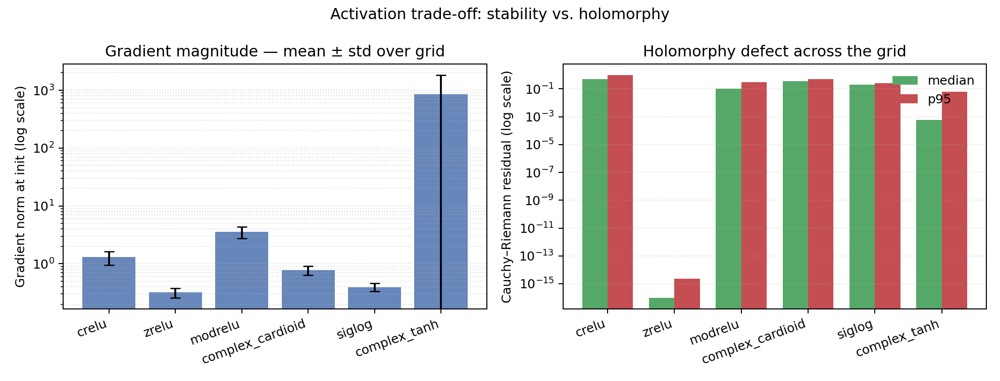
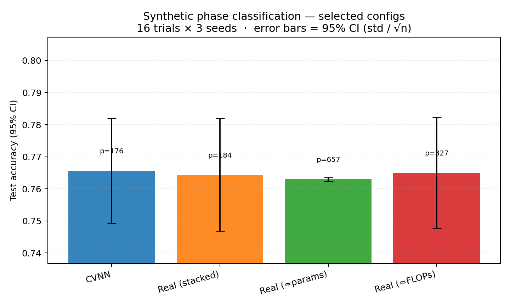
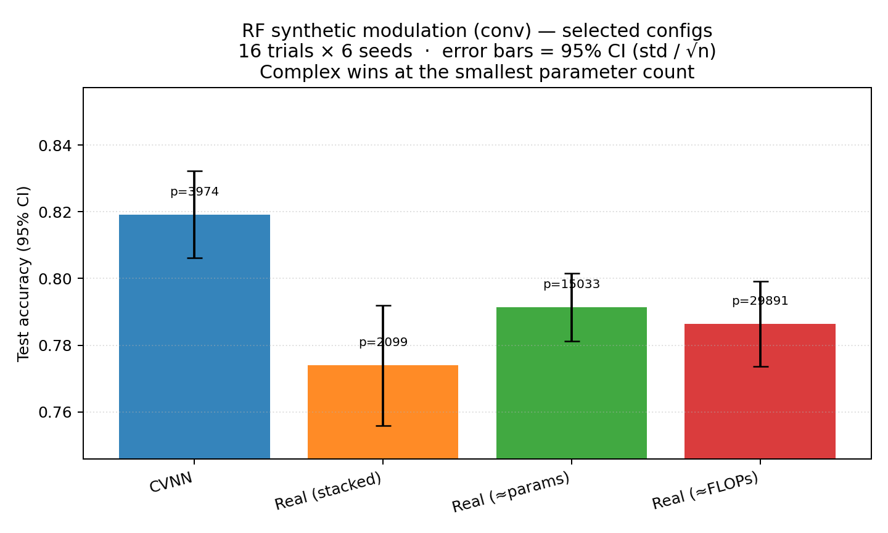
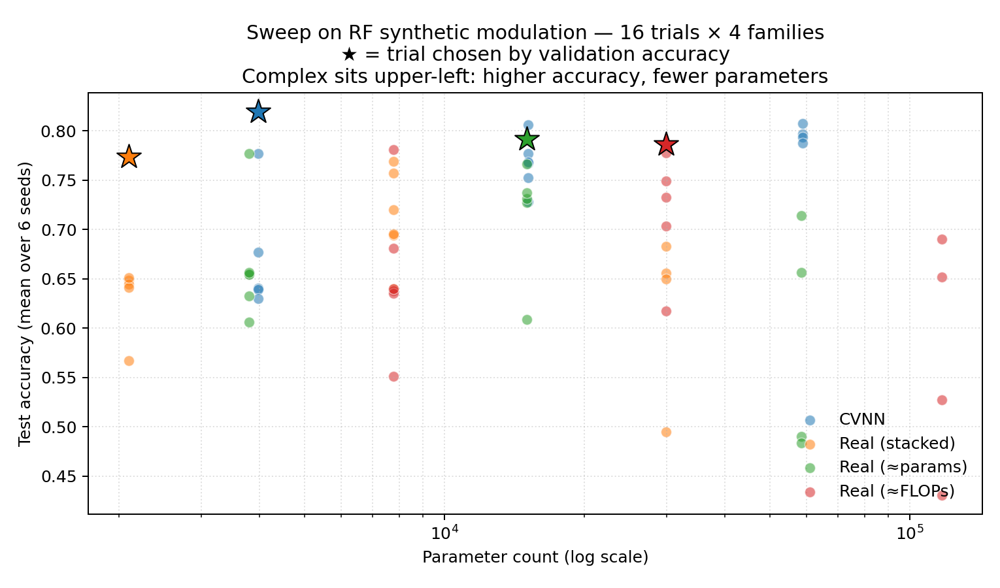

# What actually happens if neural networks live in the complex plane?

*A follow-up to a [thought experiment from a year ago](https://blog.gopenai.com/what-happens-if-we-have-complex-valued-neural-networks-a-thought-experiment-ba8dba3784ca).*

The original post asked the question and walked you up to the wall. Complex
neural networks sound elegant: weights and activations in `ℂ`, complex
multiplication that *simultaneously* scales magnitude and rotates phase, a
natural fit for any signal that already carries amplitude and phase
together. But the math sets a trap. If you want clean gradients you want
your activation to be **holomorphic**. If you want training to stay sane
you want it to be **bounded**. Liouville's theorem says you can have one
or the other, never both, on all of `ℂ`.

The post stopped there. *We don't have an activation function to do ML in
the complex space.*

So what happens if you build it anyway, measure the trade-off honestly,
and run a real benchmark?

## The trade-off, made visible

There's no good complex activation. There are six *competing* compromises:

- `CReLU` — apply ReLU to real and imaginary parts independently. Not
  holomorphic anywhere, but stable.
- `zReLU` — pass through the closed first quadrant, zero out the rest.
  Holomorphic on its support; has a discontinuous gate.
- `modReLU` — scale by `relu(|z| + bias)`, preserve phase.
  Magnitude-gated, phase-preserving; well-defined except at the origin
  when bias is positive.
- Complex `cardioid` — `0.5 (1 + cos arg z) z`. Smooth except for the
  phase singularity at zero.
- `Siglog` — `z / (1 + |z|)`. Bounded everywhere; never holomorphic.
- Complex `tanh` — actually holomorphic (away from poles). Inherits the
  poles of `tan(iy) = i tanh(y)` reflected through the analytic
  continuation, which means it blows up at `z = ± iπ/2 ≈ ±1.5708i`. We
  keep it as a cautionary baseline.

I rendered each one's Cauchy–Riemann residual over a `[-3, 3]²` patch of
`ℂ`. The picture you get is the trade-off, point by point on the plane:

`complex_tanh` looks beautifully holomorphic at the median, then
catastrophically not at the max — because the grid happens to include the
poles. `siglog` looks badly non-holomorphic everywhere, because it's
bounded. The other four sit between. **The Liouville bind isn't a clever
proof — it's a thing you can plot.**

OK, so we have activations. Do they work?

## The setup that makes "do they work?" answerable

Most CVNN papers I've read do this comparison badly. They train a complex
network on some signal-processing task, train a real network of *some*
size, show the complex one wins, and call it. Did the complex one have
more parameters? Did the real one get the same hyperparameter sweep? Was
the architecture the same? Usually you can't tell.

So the project spent most of its time on infrastructure before any
benchmark numbers were trusted:

- A small library (`cvnn`) with complex linear, conv1d, dropout,
  initializers, the six activations, and three loss functions.
- A baseline framework: every comparison runs **four** model families on
  the same task — the complex network, plus three real baselines tuned to
  match it on (a) raw stacked inputs, (b) parameter count, and (c)
  forward FLOPs.
- A budgeted random-search harness that draws the *same* hyperparameter
  trials for every family — no family lucks into a wider distribution. 16
  trials, 3-6 seeds per trial. For the paper table, the complex validation
  winner chooses the shared trial index; independent family winners are kept
  as diagnostics.
- Manifests on every result that record the git commit, environment, and
  whether the working tree was dirty when it ran. CI refuses commits with
  dirty manifests.

This sounds like overkill. It is what you need to make a "complex wins by
3pp" claim mean something.

## The two tasks

I picked two synthetic tasks that vary in one specific way: how much the
input's phase structure is something complex multiplication can naturally
exploit.

**Task A — phase classification.** A single complex sample whose phase
encodes one of 8 sectors, with magnitude jitter and AWGN. The label is
literally "which slice of the unit circle does this point sit in." A 2-D
real network on `(real, imag)` already has access to everything the
problem contains.

**Task B — RF modulation classification.** A length-128 IQ sequence drawn
from one of three PSK constellations (BPSK, QPSK, 8PSK), with AWGN at
seven SNR levels. The label depends on the joint phase statistics across
the sequence. This is a stand-in for the RadioML 2018.01A benchmark; not
the real dataset, but the same kind of problem.

## Result A: phase classification — null

After a 16×3 sweep, all four families converge to about 76% test accuracy.
Their confidence intervals are stacked on top of each other. No family
wins, no family loses.

Honest reading: **the complex inductive bias offers no measurable
advantage on a task where there's nothing for `ℂ`-multiplication to do.**
A real 2-D network can learn the same decision boundaries with the same
budget. This is the result you should expect, and seeing it is what makes
the next result believable.

## Result B: RF modulation classification — complex wins at matched capacity

After a 16×6 sweep with a small `ComplexConv1d` stack (and equivalent real
1-D conv stacks for the baselines), the matched shared-trial comparison puts
the complex network at **81.91%** test accuracy. The next-best real baseline
in that matched table reached **78.10%**. The CIs don't overlap; Welch
t-tests against the matched-parameter and matched-FLOP baselines both give
`p < 0.01`.

The parameter-efficiency story is sharper than the accuracy story. The
selected complex configuration used **3,974** parameters. The nearest
parameter-matched real baseline used **3,809** — and lost. The FLOP-matched
baseline used **7,779** parameters — and also lost. Here's the same data as
a pareto:

The blue CVNN star sits visibly above the capacity-matched real baselines.
**Higher accuracy at a comparable parameter count.** That's what the
inductive bias buys you, on a task where it has something to bite on.

## What this is and isn't

This *is* a defensible "complex wins on this task" claim. Same scaffolding,
same search budget, same architecture shape, statistically separated CIs.

This *isn't*:

- A claim about RadioML 2018.01A. The RF task is a synthetic stand-in.
  Real-world data has pulse shaping, carrier offset, fading, and labeled
  modulations beyond PSK; the loader exists now, but the CUDA sweep still
  needs to be run and audited before it becomes a result.
- A claim about deep architectures. The conv stacks here are two layers
  with global mean pool. ComplexBatchNorm and ComplexLayerNorm aren't
  written yet.
- A general "complex always wins" claim. The phase classification result
  is the counterexample.

## Where this leaves us

The original blog post ended on the impossibility result. Liouville says
you can't have a perfectly holomorphic, bounded activation. True. But the
practical question the post implied — "should you bother?" — has an
answer, and it is task-dependent in a way you can characterize:

> **The complex inductive bias pays for itself when the task carries
> structure that complex multiplication naturally encodes, and is neutral
> otherwise.**

For 1-D scalar phase classification, the complex network buys you nothing
over a 2-D real network. For sequence-shaped IQ-like data, it buys you
~4 percentage points at comparable parameter count.

The thought experiment was right that there's no clean activation. It was
incomplete in implying that this means the whole enterprise is stuck. The
right activation is "whichever workaround you can train against" —
`CReLU` works fine — and the right thing to ask is whether `ℂ`-shaped
architectures are worth their compromises on *your* task. Sometimes they
are.

---

*All code, results, manifests, and commit hashes for the figures above
are at [github.com/ashu1069/Neural-Networks-in-Complex-Spaces](https://github.com/ashu1069/Neural-Networks-in-Complex-Spaces).
The full technical report with limitations and future work lives in
[docs/report.md](report.md).*
