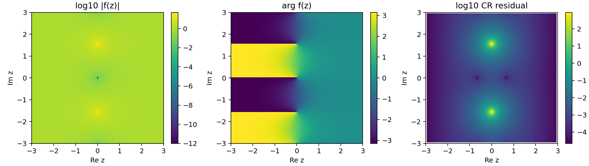

# complex_tanh

- Grid: `121 x 121`
- Extent: `[-3.0, 3.0]`
- Finite output fraction: `1.000000`
- Blow-up fraction: `0.000000`
- Max `|f(z)|`: `48.0785`
- CR residual median: `0.000578168`
- CR residual p95: `0.0633163`
- CR residual max: `905.364`

## Edge Definition

Uses torch.tanh directly.

## Singularities / Blow-Ups

Meromorphic with poles at z = i*pi*(k + 1/2).

## Gradient Norms At Init (full reference MLP)

- Mean: `855.492`
- Std: `981.427`
- Min: `212.885`
- Max: `2494.27`

## Activation Jacobian Norms (intrinsic, no MLP)

- Mean: `107.566`
- Std: `194.479`
- Min: `9.48728`
- Max: `454.317`

## Domain Plots

