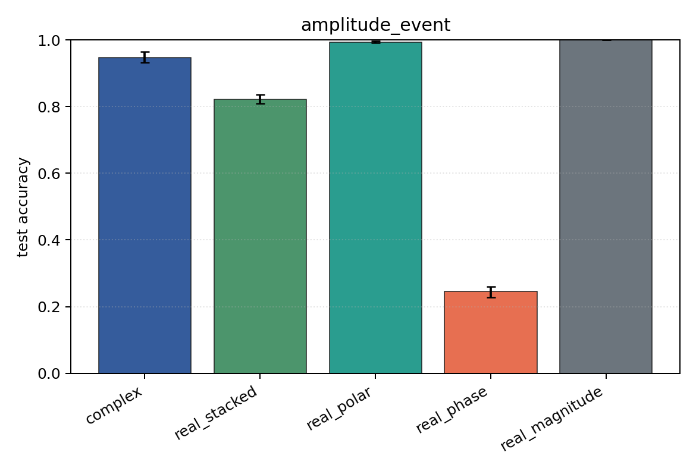

# amplitude_event

Task: `amplitude_event`.

Question: Can models classify which sensor carries an amplitude burst when phase is independent of the label?

Expected signal: magnitude, polar, Cartesian, and complex views should learn; phase-only should remain near chance.

Preset: `full`. Seeds: `[0, 1, 2, 3, 4]`. Examples/class: `512`. Channels: `4`. Time steps: `128`. Train steps: `350`.

## Plots

| family | acc | 95% CI | loss | params | madds | seconds |
| --- | ---: | ---: | ---: | ---: | ---: | ---: |
| `complex` | 0.9475 | [0.9328, 0.9652] | 0.3160 | 54346 | 108288 | 1.27 |
| `real_stacked` | 0.8225 | [0.8093, 0.8358] | 0.9382 | 51748 | 51648 | 0.80 |
| `real_polar` | 0.9936 | [0.9912, 0.9961] | 0.0125 | 76324 | 76224 | 0.54 |
| `real_phase` | 0.2456 | [0.2270, 0.2593] | 8.8913 | 51748 | 51648 | 0.43 |
| `real_magnitude` | 1.0000 | [1.0000, 1.0000] | 0.0012 | 27172 | 27072 | 0.43 |
