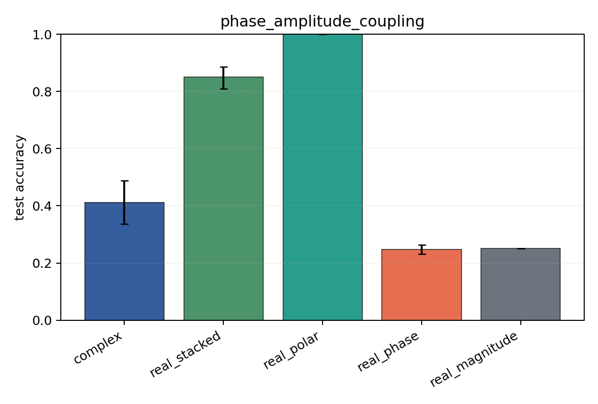

# phase_amplitude_coupling

Task: `phase_amplitude_coupling`.

Question: Can models detect phase-amplitude coupling when the high-band amplitude is locked to a low-band phase offset?

Expected signal: full complex/Cartesian/polar views should outperform pure phase or pure magnitude because the label is relational.

Preset: `full`. Seeds: `[0, 1, 2, 3, 4]`. Examples/class: `512`. Channels: `4`. Time steps: `128`. Train steps: `350`.

## Plots

| family | acc | 95% CI | loss | params | madds | seconds |
| --- | ---: | ---: | ---: | ---: | ---: | ---: |
| `complex` | 0.4118 | [0.3363, 0.4874] | 2.7421 | 54344 | 108288 | 0.59 |
| `real_stacked` | 0.8510 | [0.8088, 0.8868] | 0.5638 | 51748 | 51648 | 0.36 |
| `real_polar` | 1.0000 | [1.0000, 1.0000] | 0.0003 | 76324 | 76224 | 0.52 |
| `real_phase` | 0.2475 | [0.2309, 0.2627] | 8.3421 | 51748 | 51648 | 0.73 |
| `real_magnitude` | 0.2500 | [0.2500, 0.2500] | 1.3868 | 27172 | 27072 | 0.37 |
