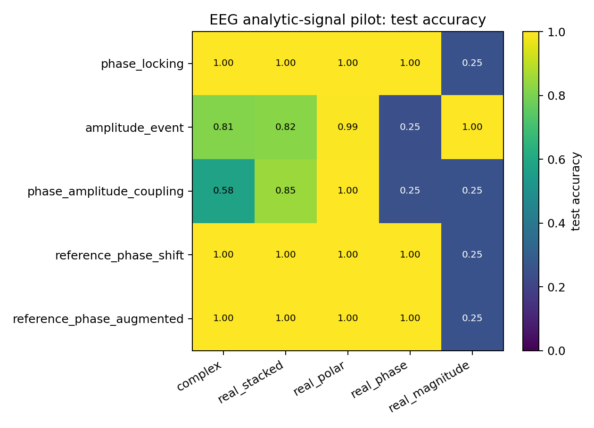
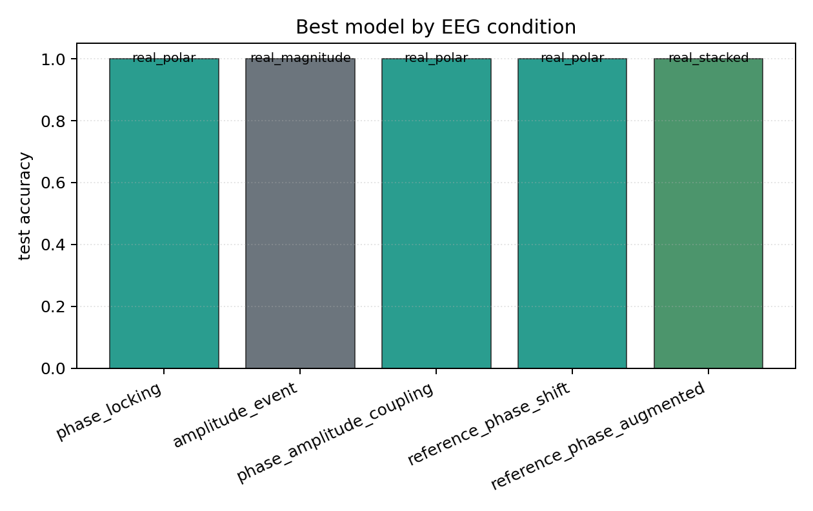

# EEG Analytic-Signal Pilot

## Plots

| condition | best | acc | complex | stacked | phase | polar | magnitude |
| --- | --- | ---: | ---: | ---: | ---: | ---: | ---: |
| `phase_locking` | `real_polar` | 1.0000 | 0.9985 | 0.9995 | 0.9995 | 1.0000 | 0.2500 |
| `amplitude_event` | `real_magnitude` | 1.0000 | 0.8137 | 0.8225 | 0.2456 | 0.9936 | 1.0000 |
| `phase_amplitude_coupling` | `real_polar` | 1.0000 | 0.5779 | 0.8510 | 0.2475 | 1.0000 | 0.2500 |
| `reference_phase_shift` | `real_polar` | 1.0000 | 0.9975 | 0.9995 | 1.0000 | 1.0000 | 0.2500 |
| `reference_phase_augmented` | `real_stacked` | 1.0000 | 0.9995 | 1.0000 | 0.9990 | 0.9995 | 0.2500 |

Each condition directory contains `raw_runs.json`, `summary.json`, `summary.md`, `manifest.json`, and plots.
