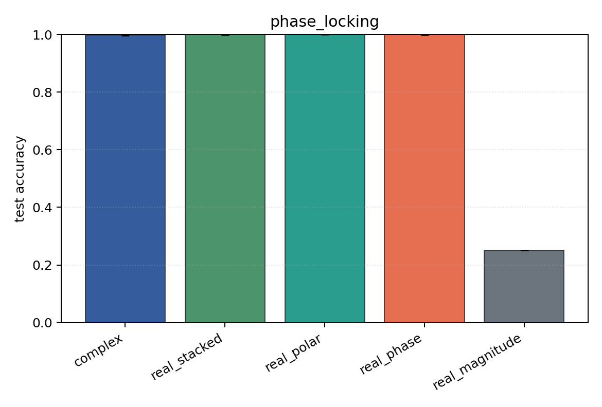

# phase_locking

Task: `phase_locking`.

Question: Can models classify inter-channel phase locking when amplitude envelopes are randomized independently of the label?

Expected signal: phase-aware and Cartesian views should learn; magnitude-only should remain near chance.

Preset: `full`. Seeds: `[0, 1, 2, 3, 4]`. Examples/class: `512`. Channels: `4`. Time steps: `128`. Train steps: `350`.

## Plots

| family | acc | 95% CI | loss | params | madds | seconds |
| --- | ---: | ---: | ---: | ---: | ---: | ---: |
| `complex` | 0.9985 | [0.9966, 1.0000] | 0.0060 | 54344 | 108288 | 0.83 |
| `real_stacked` | 0.9995 | [0.9985, 1.0000] | 0.0021 | 51748 | 51648 | 0.84 |
| `real_polar` | 1.0000 | [1.0000, 1.0000] | 0.0003 | 76324 | 76224 | 0.72 |
| `real_phase` | 0.9995 | [0.9985, 1.0000] | 0.0016 | 51748 | 51648 | 0.86 |
| `real_magnitude` | 0.2500 | [0.2500, 0.2500] | 1.3867 | 27172 | 27072 | 1.00 |
