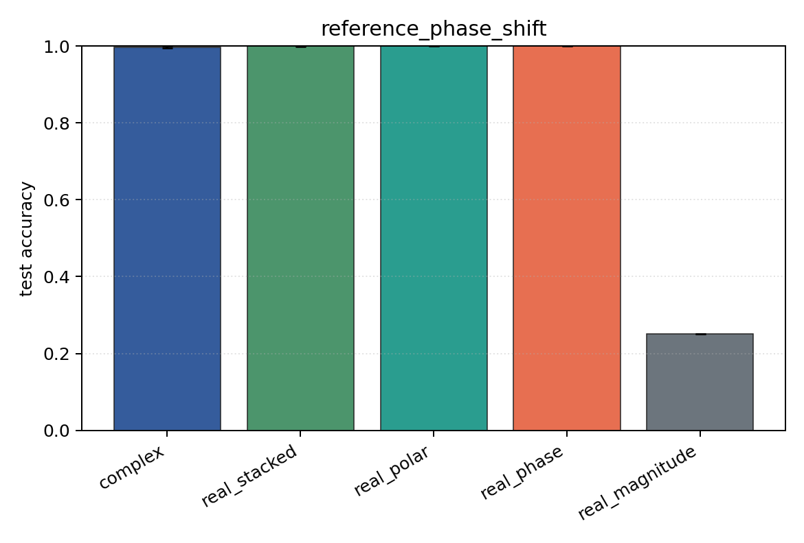

# reference_phase_shift

Task: `phase_locking`.

Question: Does a model trained in one sensor-reference phase convention respect a common unseen analytic-signal rotation?

Expected signal: coordinate-dependent models may degrade under the reference shift; magnitude-only remains invariant but information-poor.

Preset: `full`. Seeds: `[0, 1, 2, 3, 4]`. Examples/class: `512`. Channels: `4`. Time steps: `128`. Train steps: `350`.

## Plots

| family | acc | 95% CI | loss | params | madds | seconds |
| --- | ---: | ---: | ---: | ---: | ---: | ---: |
| `complex` | 0.9975 | [0.9956, 0.9995] | 0.0081 | 54344 | 108288 | 0.76 |
| `real_stacked` | 0.9995 | [0.9985, 1.0000] | 0.0007 | 51748 | 51648 | 0.41 |
| `real_polar` | 1.0000 | [1.0000, 1.0000] | 0.0005 | 76324 | 76224 | 0.95 |
| `real_phase` | 1.0000 | [1.0000, 1.0000] | 0.0002 | 51748 | 51648 | 0.97 |
| `real_magnitude` | 0.2500 | [0.2500, 0.2500] | 1.3867 | 27172 | 27072 | 0.64 |
