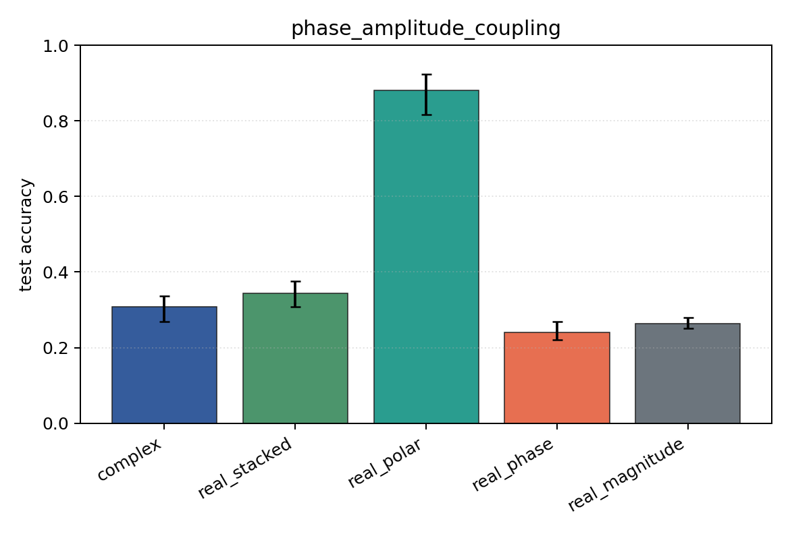

# phase_amplitude_coupling

Task: `phase_amplitude_coupling`.

Question: Can models detect phase-amplitude coupling when the high-band amplitude is locked to a low-band phase offset?

Expected signal: full complex/Cartesian/polar views should outperform pure phase or pure magnitude because the label is relational.

Preset: `standard`. Seeds: `[0, 1, 2]`. Examples/class: `128`. Channels: `4`. Time steps: `64`. Train steps: `120`.

## Plots

| family | acc | 95% CI | loss | params | madds | seconds |
| --- | ---: | ---: | ---: | ---: | ---: | ---: |
| `complex` | 0.3077 | [0.2692, 0.3365] | 4.1698 | 13736 | 27264 | 0.07 |
| `real_stacked` | 0.3429 | [0.3077, 0.3750] | 5.7972 | 13012 | 12960 | 0.04 |
| `real_polar` | 0.8814 | [0.8173, 0.9231] | 0.2958 | 19156 | 19104 | 0.04 |
| `real_phase` | 0.2404 | [0.2212, 0.2692] | 6.4273 | 13012 | 12960 | 0.04 |
| `real_magnitude` | 0.2628 | [0.2500, 0.2788] | 1.3881 | 6868 | 6816 | 0.04 |
