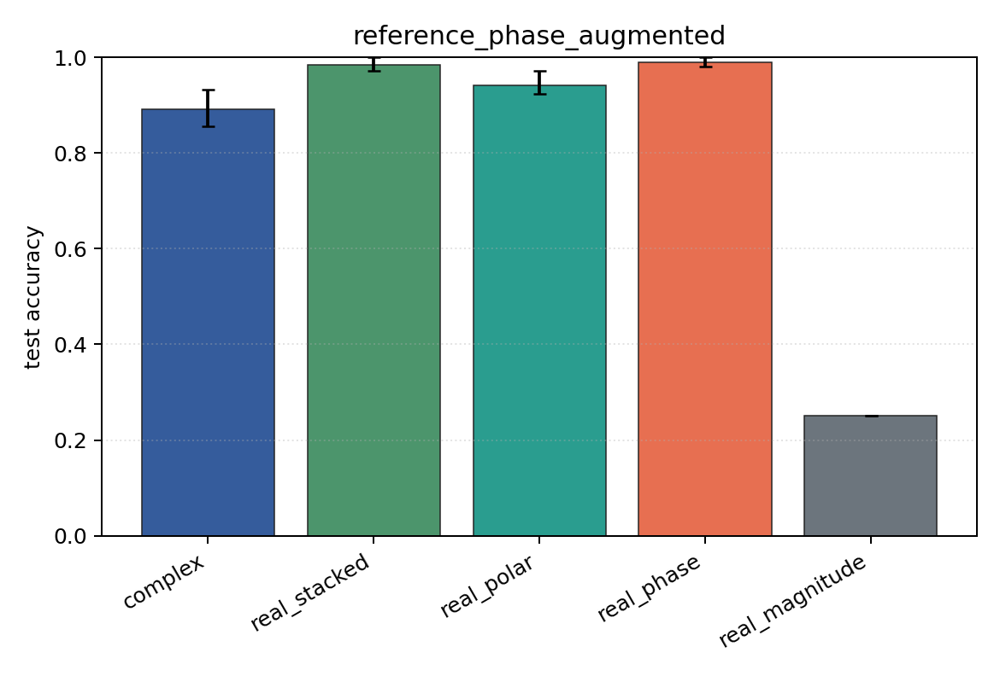

# reference_phase_augmented

Task: `phase_locking`.

Question: Does random reference-phase augmentation recover robustness to the unseen fixed reference shift?

Expected signal: phase-aware models should improve relative to the unaugmented reference-shift condition.

Preset: `standard`. Seeds: `[0, 1, 2]`. Examples/class: `128`. Channels: `4`. Time steps: `64`. Train steps: `120`.

## Plots

| family | acc | 95% CI | loss | params | madds | seconds |
| --- | ---: | ---: | ---: | ---: | ---: | ---: |
| `complex` | 0.8910 | [0.8558, 0.9327] | 0.3468 | 13736 | 27264 | 0.07 |
| `real_stacked` | 0.9840 | [0.9712, 1.0000] | 0.0414 | 13012 | 12960 | 0.04 |
| `real_polar` | 0.9423 | [0.9231, 0.9712] | 0.1322 | 19156 | 19104 | 0.04 |
| `real_phase` | 0.9904 | [0.9808, 1.0000] | 0.0307 | 13012 | 12960 | 0.04 |
| `real_magnitude` | 0.2500 | [0.2500, 0.2500] | 1.3877 | 6868 | 6816 | 0.04 |
