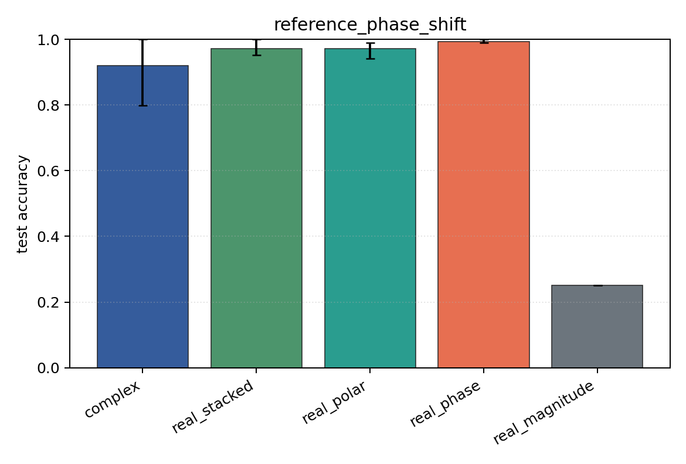

# reference_phase_shift

Task: `phase_locking`.

Question: Does a model trained in one sensor-reference phase convention respect a common unseen analytic-signal rotation?

Expected signal: coordinate-dependent models may degrade under the reference shift; magnitude-only remains invariant but information-poor.

Preset: `standard`. Seeds: `[0, 1, 2]`. Examples/class: `128`. Channels: `4`. Time steps: `64`. Train steps: `120`.

## Plots

| family | acc | 95% CI | loss | params | madds | seconds |
| --- | ---: | ---: | ---: | ---: | ---: | ---: |
| `complex` | 0.9199 | [0.7981, 1.0000] | 0.3955 | 13736 | 27264 | 0.07 |
| `real_stacked` | 0.9712 | [0.9519, 1.0000] | 0.0780 | 13012 | 12960 | 0.04 |
| `real_polar` | 0.9712 | [0.9423, 0.9904] | 0.1188 | 19156 | 19104 | 0.04 |
| `real_phase` | 0.9936 | [0.9904, 1.0000] | 0.0193 | 13012 | 12960 | 0.04 |
| `real_magnitude` | 0.2500 | [0.2500, 0.2500] | 1.3877 | 6868 | 6816 | 0.04 |
