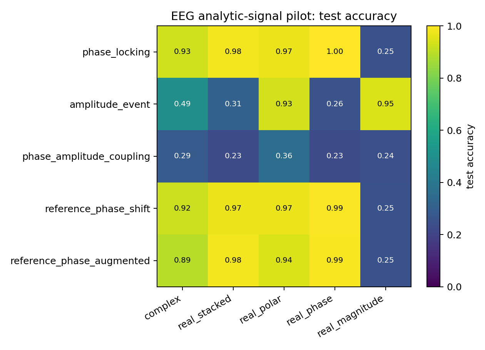
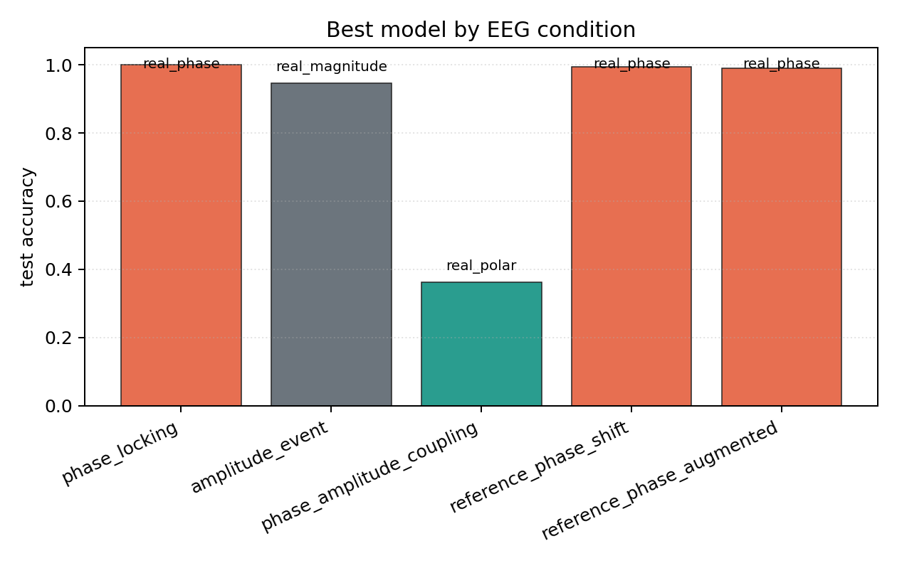

# EEG Analytic-Signal Pilot

## Plots

| condition | best | acc | complex | stacked | phase | polar | magnitude |
| --- | --- | ---: | ---: | ---: | ---: | ---: | ---: |
| `phase_locking` | `real_phase` | 1.0000 | 0.9263 | 0.9808 | 1.0000 | 0.9712 | 0.2500 |
| `amplitude_event` | `real_magnitude` | 0.9455 | 0.4936 | 0.3109 | 0.2564 | 0.9327 | 0.9455 |
| `phase_amplitude_coupling` | `real_polar` | 0.3622 | 0.2853 | 0.2308 | 0.2276 | 0.3622 | 0.2436 |
| `reference_phase_shift` | `real_phase` | 0.9936 | 0.9199 | 0.9712 | 0.9936 | 0.9712 | 0.2500 |
| `reference_phase_augmented` | `real_phase` | 0.9904 | 0.8910 | 0.9840 | 0.9904 | 0.9423 | 0.2500 |

Each condition directory contains `raw_runs.json`, `summary.json`, `summary.md`, `manifest.json`, and plots.
