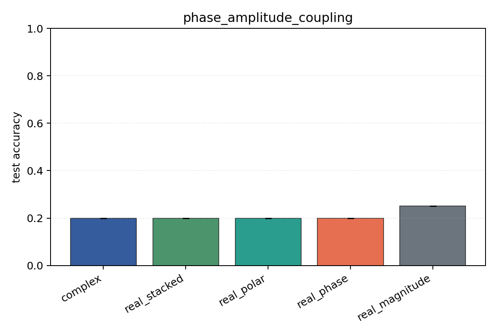

# phase_amplitude_coupling

Task: `phase_amplitude_coupling`.

Question: Can models detect phase-amplitude coupling when the high-band amplitude is locked to a low-band phase offset?

Expected signal: full complex/Cartesian/polar views should outperform pure phase or pure magnitude because the label is relational.

Preset: `smoke`. Seeds: `[0]`. Examples/class: `24`. Channels: `4`. Time steps: `32`. Train steps: `25`.

## Plots

| family | acc | 95% CI | loss | params | madds | seconds |
| --- | ---: | ---: | ---: | ---: | ---: | ---: |
| `complex` | 0.2000 | [0.2000, 0.2000] | 1.6835 | 2280 | 4480 | 0.01 |
| `real_stacked` | 0.2000 | [0.2000, 0.2000] | 1.9735 | 2164 | 2144 | 0.01 |
| `real_polar` | 0.2000 | [0.2000, 0.2000] | 1.4239 | 3188 | 3168 | 0.01 |
| `real_phase` | 0.2000 | [0.2000, 0.2000] | 1.6981 | 2164 | 2144 | 0.01 |
| `real_magnitude` | 0.2500 | [0.2500, 0.2500] | 1.3924 | 1140 | 1120 | 0.01 |
