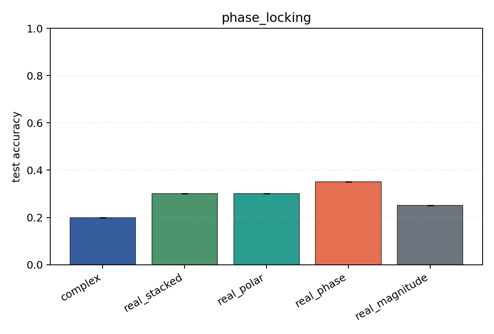

# phase_locking

Task: `phase_locking`.

Question: Can models classify inter-channel phase locking when amplitude envelopes are randomized independently of the label?

Expected signal: phase-aware and Cartesian views should learn; magnitude-only should remain near chance.

Preset: `smoke`. Seeds: `[0]`. Examples/class: `24`. Channels: `4`. Time steps: `32`. Train steps: `25`.

## Plots

| family | acc | 95% CI | loss | params | madds | seconds |
| --- | ---: | ---: | ---: | ---: | ---: | ---: |
| `complex` | 0.2000 | [0.2000, 0.2000] | 1.4775 | 2280 | 4480 | 0.01 |
| `real_stacked` | 0.3000 | [0.3000, 0.3000] | 1.6407 | 2164 | 2144 | 0.01 |
| `real_polar` | 0.3000 | [0.3000, 0.3000] | 1.4713 | 3188 | 3168 | 0.01 |
| `real_phase` | 0.3500 | [0.3500, 0.3500] | 1.6066 | 2164 | 2144 | 0.01 |
| `real_magnitude` | 0.2500 | [0.2500, 0.2500] | 1.3853 | 1140 | 1120 | 0.01 |
