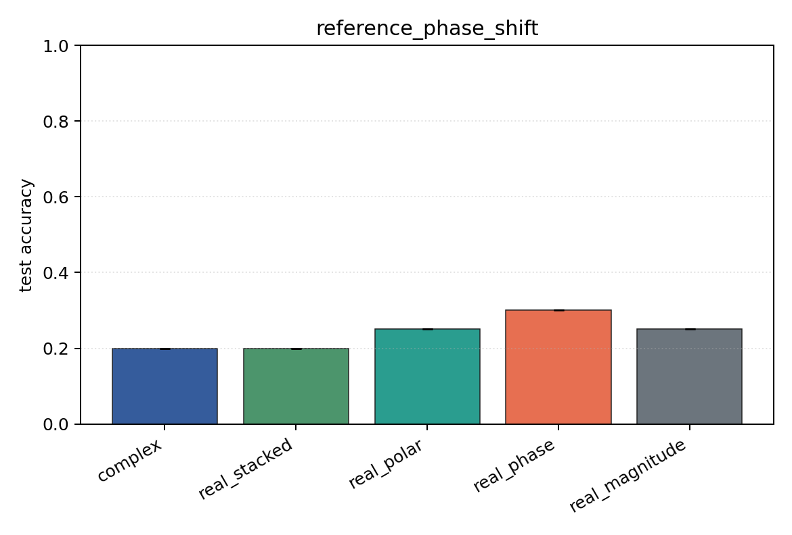

# reference_phase_shift

Task: `phase_locking`.

Question: Does a model trained in one sensor-reference phase convention respect a common unseen analytic-signal rotation?

Expected signal: coordinate-dependent models may degrade under the reference shift; magnitude-only remains invariant but information-poor.

Preset: `smoke`. Seeds: `[0]`. Examples/class: `24`. Channels: `4`. Time steps: `32`. Train steps: `25`.

## Plots

| family | acc | 95% CI | loss | params | madds | seconds |
| --- | ---: | ---: | ---: | ---: | ---: | ---: |
| `complex` | 0.2000 | [0.2000, 0.2000] | 1.3976 | 2280 | 4480 | 0.01 |
| `real_stacked` | 0.2000 | [0.2000, 0.2000] | 1.6694 | 2164 | 2144 | 0.01 |
| `real_polar` | 0.2500 | [0.2500, 0.2500] | 1.5490 | 3188 | 3168 | 0.01 |
| `real_phase` | 0.3000 | [0.3000, 0.3000] | 1.5373 | 2164 | 2144 | 0.01 |
| `real_magnitude` | 0.2500 | [0.2500, 0.2500] | 1.3853 | 1140 | 1120 | 0.01 |
