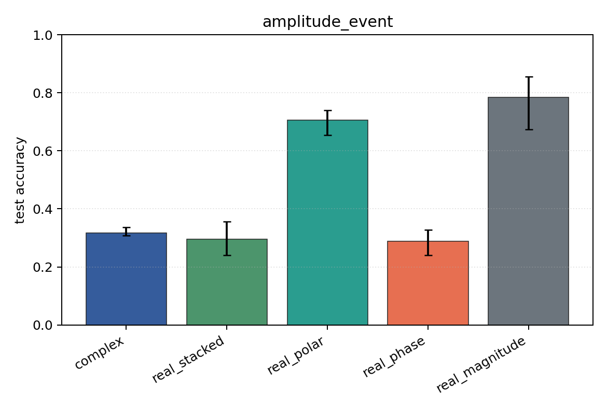

# amplitude_event

Task: `amplitude_event`.

Question: Can models classify which sensor carries an amplitude burst when phase is independent of the label?

Expected signal: magnitude, polar, Cartesian, and complex views should learn; phase-only should remain near chance.

Preset: `standard`. Seeds: `[0, 1, 2]`. Examples/class: `128`. Channels: `4`. Time steps: `64`. Train steps: `120`.

## Plots

| family | acc | 95% CI | loss | params | madds | seconds |
| --- | ---: | ---: | ---: | ---: | ---: | ---: |
| `complex` | 0.3173 | [0.3077, 0.3365] | 1.3919 | 13736 | 27264 | 0.21 |
| `real_stacked` | 0.2949 | [0.2404, 0.3558] | 1.3816 | 13012 | 12960 | 0.14 |
| `real_polar` | 0.7051 | [0.6538, 0.7404] | 0.8570 | 19156 | 19104 | 0.14 |
| `real_phase` | 0.2885 | [0.2404, 0.3269] | 1.4071 | 13012 | 12960 | 0.15 |
| `real_magnitude` | 0.7853 | [0.6731, 0.8558] | 1.0751 | 6868 | 6816 | 0.21 |
