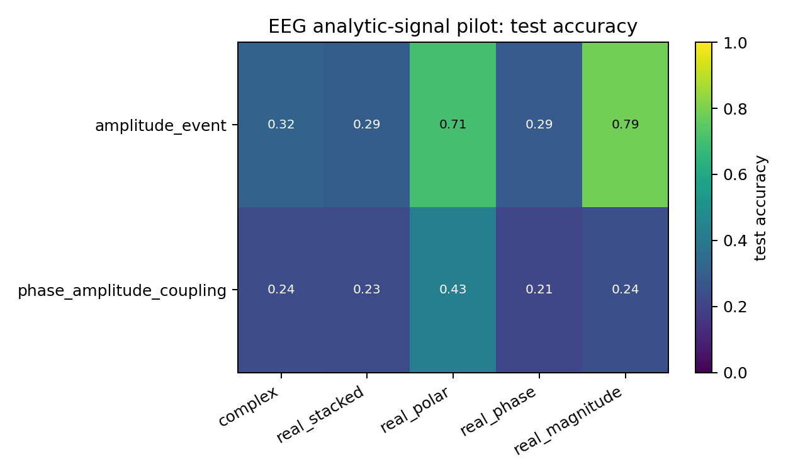
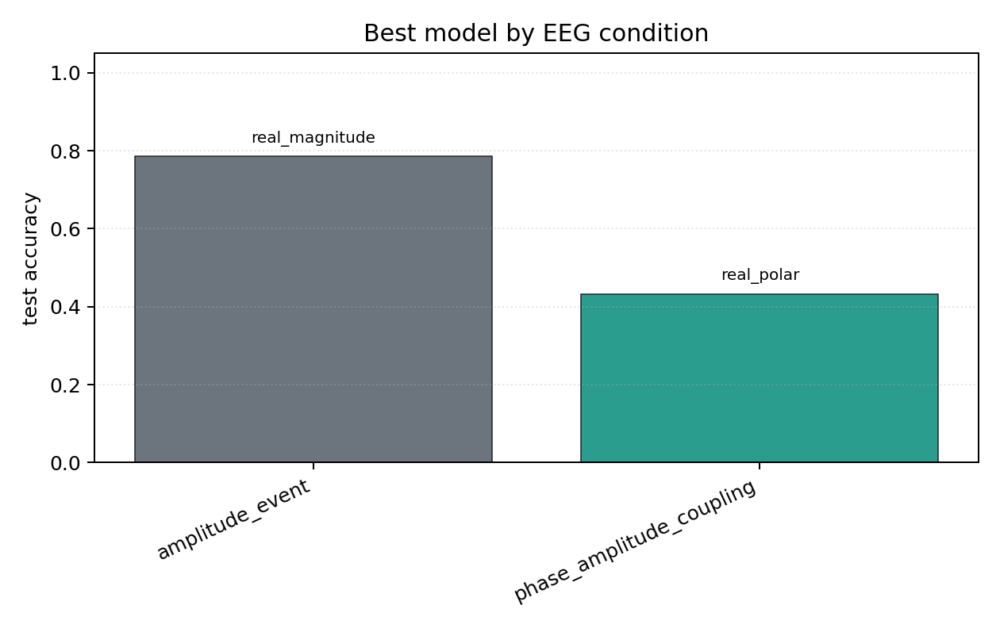

# EEG Analytic-Signal Pilot

## Plots

| condition | best | acc | complex | stacked | phase | polar | magnitude |
| --- | --- | ---: | ---: | ---: | ---: | ---: | ---: |
| `amplitude_event` | `real_magnitude` | 0.7853 | 0.3173 | 0.2949 | 0.2885 | 0.7051 | 0.7853 |
| `phase_amplitude_coupling` | `real_polar` | 0.4327 | 0.2372 | 0.2308 | 0.2147 | 0.4327 | 0.2436 |

Each condition directory contains `raw_runs.json`, `summary.json`, `summary.md`, `manifest.json`, and plots.
