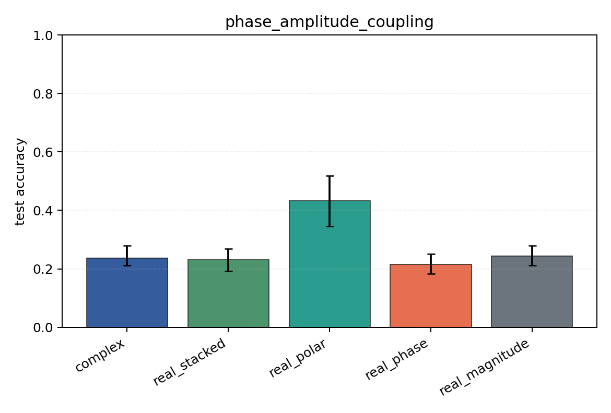

# phase_amplitude_coupling

Task: `phase_amplitude_coupling`.

Question: Can models detect phase-amplitude coupling when the high-band amplitude is locked to a low-band phase offset?

Expected signal: full complex/Cartesian/polar views should outperform pure phase or pure magnitude because the label is relational.

Preset: `standard`. Seeds: `[0, 1, 2]`. Examples/class: `128`. Channels: `4`. Time steps: `64`. Train steps: `120`.

## Plots

| family | acc | 95% CI | loss | params | madds | seconds |
| --- | ---: | ---: | ---: | ---: | ---: | ---: |
| `complex` | 0.2372 | [0.2115, 0.2788] | 1.4996 | 13736 | 27264 | 0.26 |
| `real_stacked` | 0.2308 | [0.1923, 0.2692] | 1.4451 | 13012 | 12960 | 0.21 |
| `real_polar` | 0.4327 | [0.3462, 0.5192] | 1.2903 | 19156 | 19104 | 0.16 |
| `real_phase` | 0.2147 | [0.1827, 0.2500] | 1.4500 | 13012 | 12960 | 0.25 |
| `real_magnitude` | 0.2436 | [0.2115, 0.2788] | 1.3964 | 6868 | 6816 | 0.16 |
