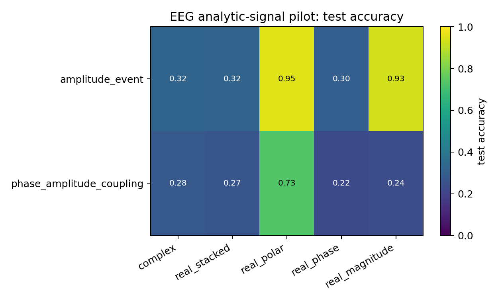
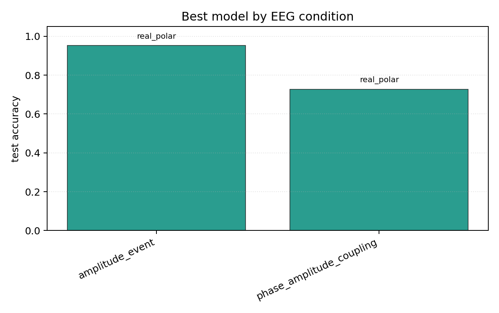

# EEG Analytic-Signal Pilot

## Plots

| condition | best | acc | complex | stacked | phase | polar | magnitude |
| --- | --- | ---: | ---: | ---: | ---: | ---: | ---: |
| `amplitude_event` | `real_polar` | 0.9519 | 0.3205 | 0.3173 | 0.2981 | 0.9519 | 0.9327 |
| `phase_amplitude_coupling` | `real_polar` | 0.7276 | 0.2788 | 0.2692 | 0.2244 | 0.7276 | 0.2372 |

Each condition directory contains `raw_runs.json`, `summary.json`, `summary.md`, `manifest.json`, and plots.
