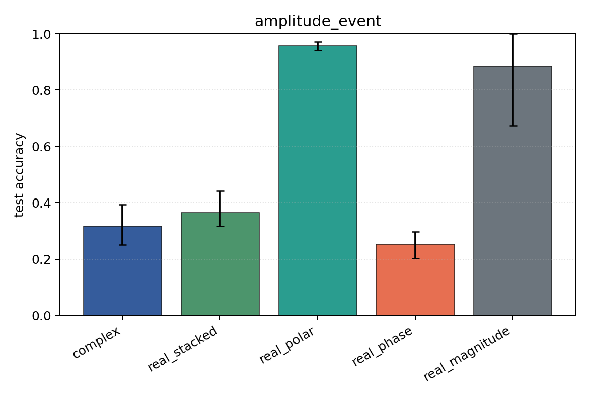

# amplitude_event

Task: `amplitude_event`.

Question: Can models classify which sensor carries an amplitude burst when phase is independent of the label?

Expected signal: magnitude, polar, Cartesian, and complex views should learn; phase-only should remain near chance.

Preset: `standard`. Seeds: `[0, 1, 2]`. Examples/class: `128`. Channels: `4`. Time steps: `64`. Train steps: `120`.

## Plots

| family | acc | 95% CI | loss | params | madds | seconds |
| --- | ---: | ---: | ---: | ---: | ---: | ---: |
| `complex` | 0.3173 | [0.2500, 0.3942] | 2.5788 | 13736 | 27264 | 0.20 |
| `real_stacked` | 0.3654 | [0.3173, 0.4423] | 3.1541 | 13012 | 12960 | 0.11 |
| `real_polar` | 0.9583 | [0.9423, 0.9712] | 0.1172 | 19156 | 19104 | 0.10 |
| `real_phase` | 0.2532 | [0.2019, 0.2981] | 4.0212 | 13012 | 12960 | 0.10 |
| `real_magnitude` | 0.8846 | [0.6731, 1.0000] | 0.2862 | 6868 | 6816 | 0.12 |
