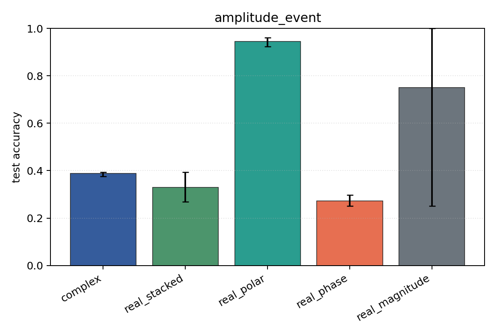

# amplitude_event

Task: `amplitude_event`.

Question: Can models classify which sensor carries an amplitude burst when phase is independent of the label?

Expected signal: magnitude, polar, Cartesian, and complex views should learn; phase-only should remain near chance.

Preset: `standard`. Seeds: `[0, 1, 2]`. Examples/class: `128`. Channels: `4`. Time steps: `64`. Train steps: `120`.

## Plots

| family | acc | 95% CI | loss | params | madds | seconds |
| --- | ---: | ---: | ---: | ---: | ---: | ---: |
| `complex` | 0.3878 | [0.3750, 0.3942] | 3.6780 | 13736 | 27264 | 0.26 |
| `real_stacked` | 0.3301 | [0.2692, 0.3942] | 5.3312 | 13012 | 12960 | 0.19 |
| `real_polar` | 0.9455 | [0.9231, 0.9615] | 0.1290 | 19156 | 19104 | 0.18 |
| `real_phase` | 0.2724 | [0.2500, 0.2981] | 6.6866 | 13012 | 12960 | 0.15 |
| `real_magnitude` | 0.7500 | [0.2500, 1.0000] | 0.4686 | 6868 | 6816 | 0.12 |
