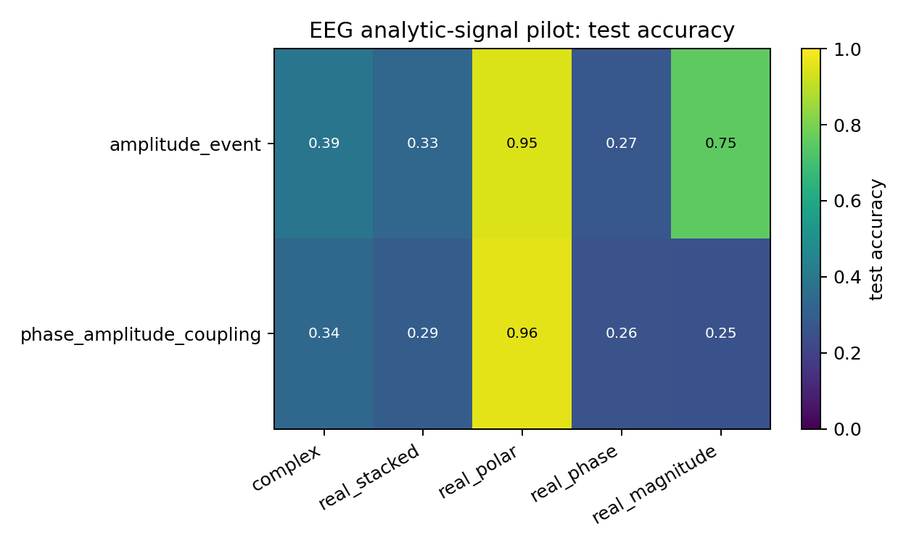
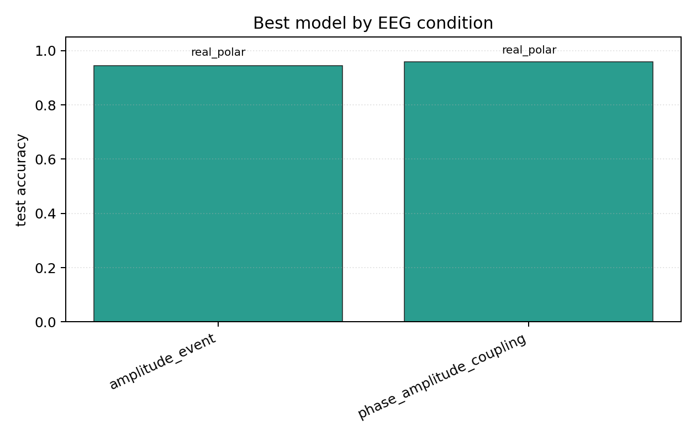

# EEG Analytic-Signal Pilot

## Plots

| condition | best | acc | complex | stacked | phase | polar | magnitude |
| --- | --- | ---: | ---: | ---: | ---: | ---: | ---: |
| `amplitude_event` | `real_polar` | 0.9455 | 0.3878 | 0.3301 | 0.2724 | 0.9455 | 0.7500 |
| `phase_amplitude_coupling` | `real_polar` | 0.9583 | 0.3397 | 0.2949 | 0.2564 | 0.9583 | 0.2532 |

Each condition directory contains `raw_runs.json`, `summary.json`, `summary.md`, `manifest.json`, and plots.
