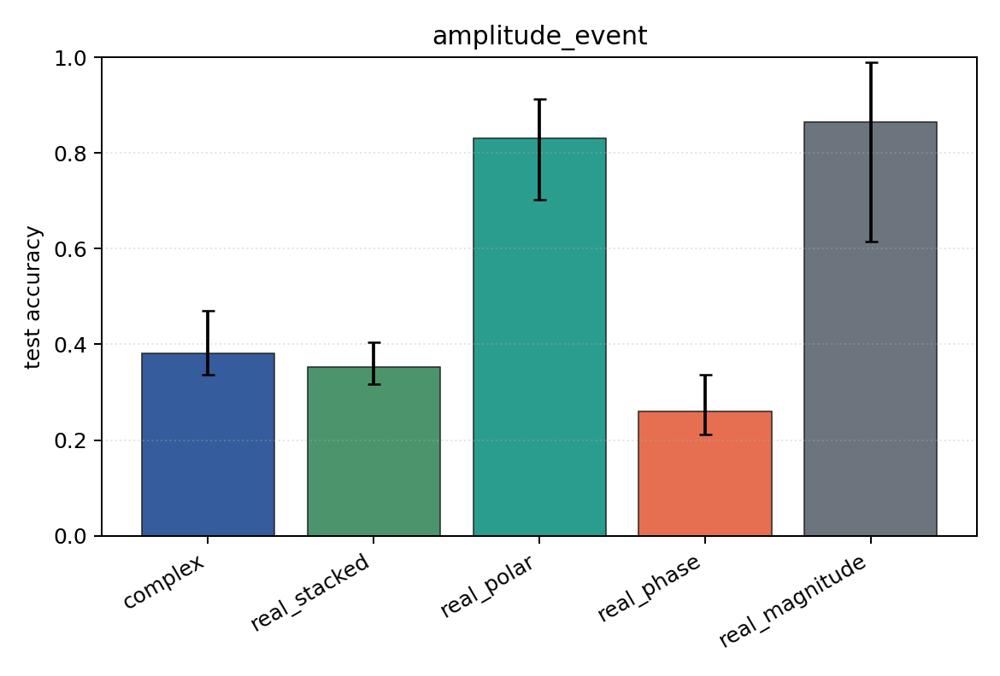

# amplitude_event

Task: `amplitude_event`.

Question: Can models classify which sensor carries an amplitude burst when phase is independent of the label?

Expected signal: magnitude, polar, Cartesian, and complex views should learn; phase-only should remain near chance.

Preset: `standard`. Seeds: `[0, 1, 2]`. Examples/class: `128`. Channels: `4`. Time steps: `64`. Train steps: `120`.

## Plots

| family | acc | 95% CI | loss | params | madds | seconds |
| --- | ---: | ---: | ---: | ---: | ---: | ---: |
| `complex` | 0.3814 | [0.3365, 0.4712] | 8.8949 | 13736 | 27264 | 0.28 |
| `real_stacked` | 0.3526 | [0.3173, 0.4038] | 7.8336 | 13012 | 12960 | 0.25 |
| `real_polar` | 0.8301 | [0.7019, 0.9135] | 0.5439 | 19156 | 19104 | 0.14 |
| `real_phase` | 0.2596 | [0.2115, 0.3365] | 10.9315 | 13012 | 12960 | 0.22 |
| `real_magnitude` | 0.8654 | [0.6154, 0.9904] | 0.2522 | 6868 | 6816 | 0.19 |
