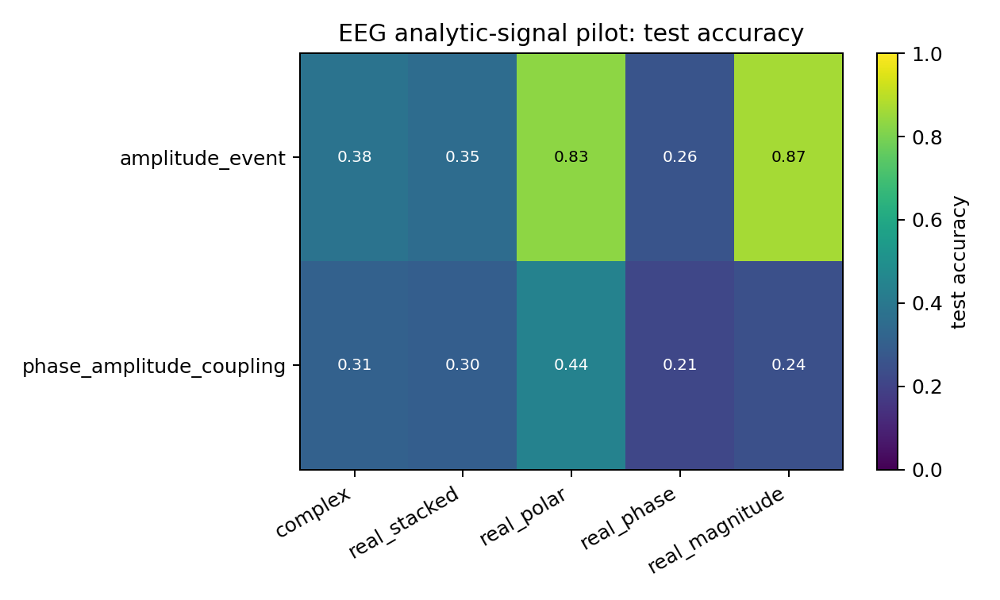
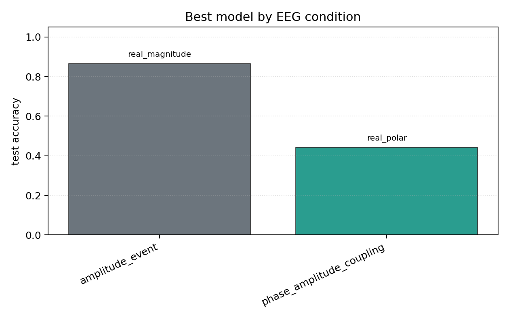

# EEG Analytic-Signal Pilot

## Plots

| condition | best | acc | complex | stacked | phase | polar | magnitude |
| --- | --- | ---: | ---: | ---: | ---: | ---: | ---: |
| `amplitude_event` | `real_magnitude` | 0.8654 | 0.3814 | 0.3526 | 0.2596 | 0.8301 | 0.8654 |
| `phase_amplitude_coupling` | `real_polar` | 0.4423 | 0.3109 | 0.2981 | 0.2115 | 0.4423 | 0.2436 |

Each condition directory contains `raw_runs.json`, `summary.json`, `summary.md`, `manifest.json`, and plots.
