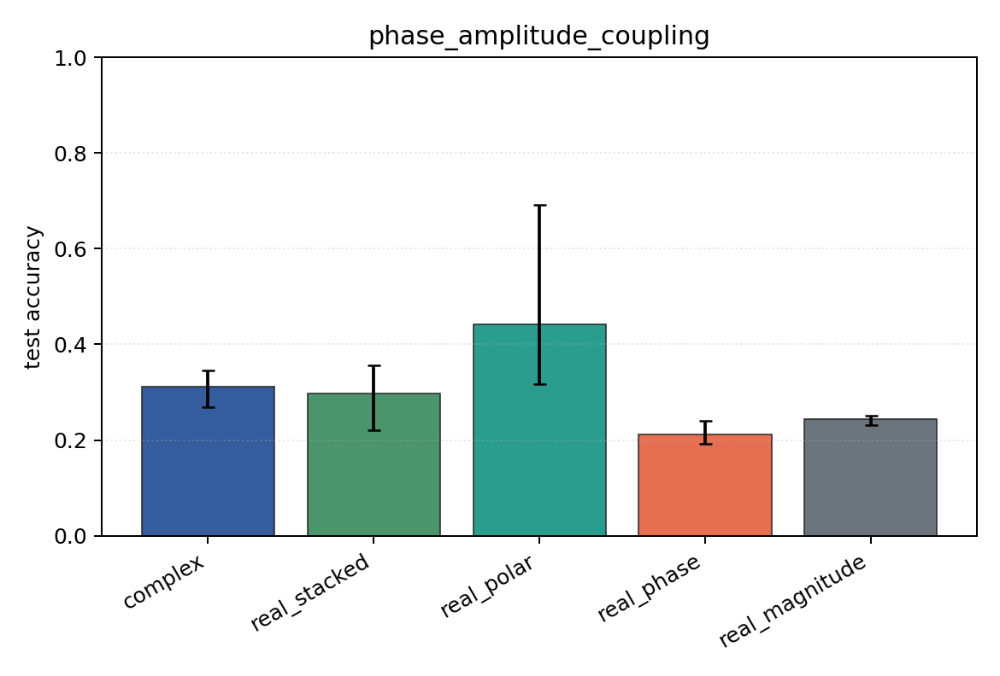

# phase_amplitude_coupling

Task: `phase_amplitude_coupling`.

Question: Can models detect phase-amplitude coupling when the high-band amplitude is locked to a low-band phase offset?

Expected signal: full complex/Cartesian/polar views should outperform pure phase or pure magnitude because the label is relational.

Preset: `standard`. Seeds: `[0, 1, 2]`. Examples/class: `128`. Channels: `4`. Time steps: `64`. Train steps: `120`.

## Plots

| family | acc | 95% CI | loss | params | madds | seconds |
| --- | ---: | ---: | ---: | ---: | ---: | ---: |
| `complex` | 0.3109 | [0.2692, 0.3462] | 8.7423 | 13736 | 27264 | 0.23 |
| `real_stacked` | 0.2981 | [0.2212, 0.3558] | 7.7910 | 13012 | 12960 | 0.22 |
| `real_polar` | 0.4423 | [0.3173, 0.6923] | 1.4555 | 19156 | 19104 | 0.19 |
| `real_phase` | 0.2115 | [0.1923, 0.2404] | 8.8061 | 13012 | 12960 | 0.20 |
| `real_magnitude` | 0.2436 | [0.2308, 0.2500] | 1.3909 | 6868 | 6816 | 0.24 |
