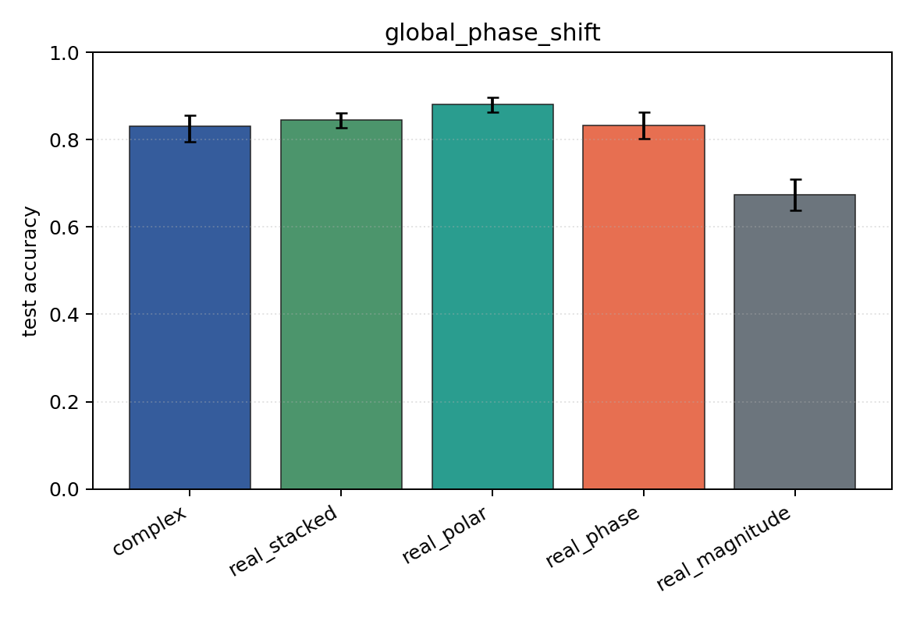
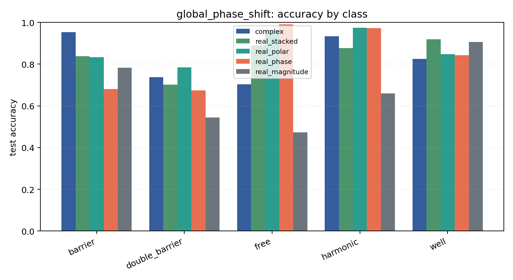

# global_phase_shift

Task: `potential_inverse`.

Question: Do models trained in one global-phase convention respect the physical invariance psi -> exp(i theta) psi?

Expected signal: coordinate-dependent models may degrade under an unseen global phase; magnitude-only is invariant but information-poor.

Preset: `full`. Seeds: `[0, 1, 2, 3, 4]`. Examples/class: `512`. Grid: `128`. Train steps: `400`.

## Plots

| family | acc | 95% CI | loss | params | madds | seconds |
| --- | ---: | ---: | ---: | ---: | ---: | ---: |
| `complex` | 0.8306 | [0.7945, 0.8553] | 0.4967 | 11018 | 2704000 | 4.95 |
| `real_stacked` | 0.8451 | [0.8278, 0.8608] | 0.3919 | 5669 | 696480 | 1.75 |
| `real_polar` | 0.8804 | [0.8631, 0.8969] | 0.3138 | 5829 | 716960 | 0.90 |
| `real_phase` | 0.8322 | [0.8020, 0.8624] | 0.3699 | 5669 | 696480 | 1.00 |
| `real_magnitude` | 0.6729 | [0.6373, 0.7086] | 0.7126 | 5509 | 676000 | 1.01 |
