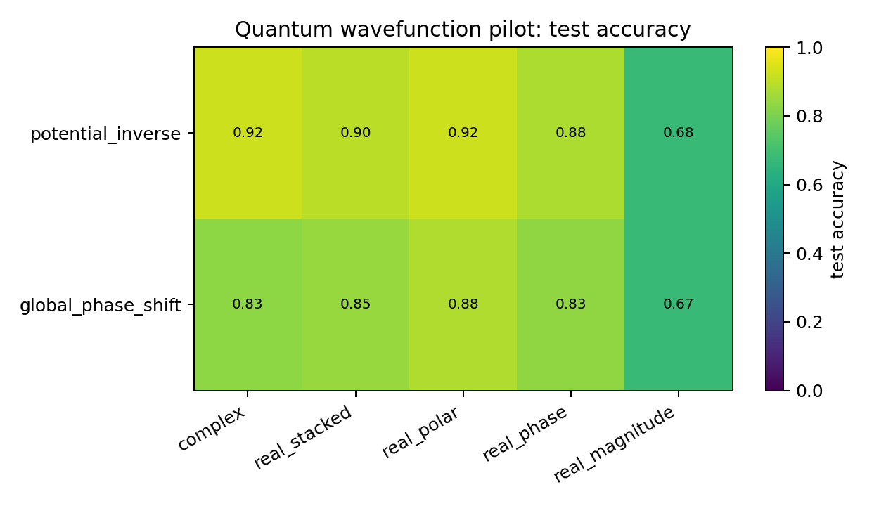
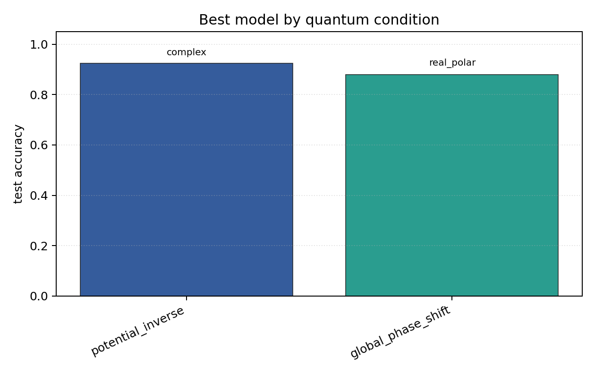

# Quantum Wavefunction Pilot

## Plots

| condition | best | acc | complex | stacked | phase | polar | magnitude |
| --- | --- | ---: | ---: | ---: | ---: | ---: | ---: |
| `potential_inverse` | `complex` | 0.9247 | 0.9247 | 0.8984 | 0.8788 | 0.9227 | 0.6769 |
| `global_phase_shift` | `real_polar` | 0.8804 | 0.8306 | 0.8451 | 0.8322 | 0.8804 | 0.6729 |

Each condition directory contains `raw_runs.json`, `summary.json`, `summary.md`, `manifest.json`, and plots.
