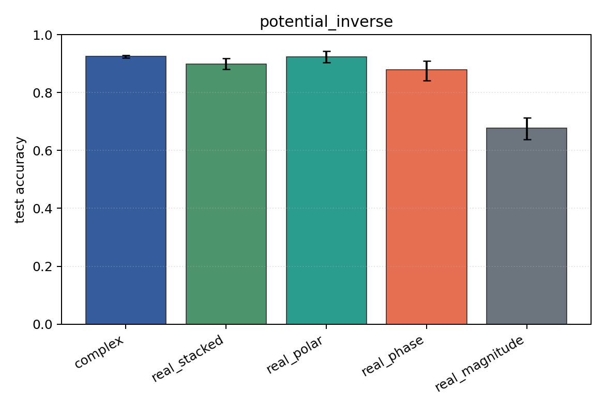
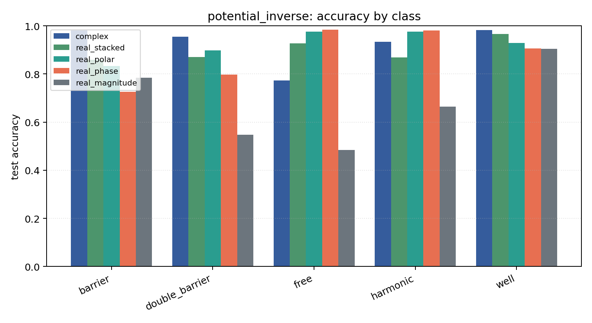

# potential_inverse

Task: `potential_inverse`.

Question: Can models infer which potential generated the observed final wavefunction after 1D Schrodinger evolution?

Expected signal: full complex/Cartesian/polar inputs should outperform phase-only or density-only views when both amplitude and phase carry scattering information.

Preset: `full`. Seeds: `[0, 1, 2, 3, 4]`. Examples/class: `512`. Grid: `128`. Train steps: `400`.

## Plots

| family | acc | 95% CI | loss | params | madds | seconds |
| --- | ---: | ---: | ---: | ---: | ---: | ---: |
| `complex` | 0.9247 | [0.9192, 0.9298] | 0.1941 | 11018 | 2704000 | 3.85 |
| `real_stacked` | 0.8984 | [0.8804, 0.9176] | 0.2991 | 5669 | 696480 | 0.86 |
| `real_polar` | 0.9227 | [0.9035, 0.9427] | 0.2195 | 5829 | 716960 | 0.93 |
| `real_phase` | 0.8788 | [0.8412, 0.9086] | 0.2995 | 5669 | 696480 | 1.00 |
| `real_magnitude` | 0.6769 | [0.6384, 0.7133] | 0.7136 | 5509 | 676000 | 0.94 |
