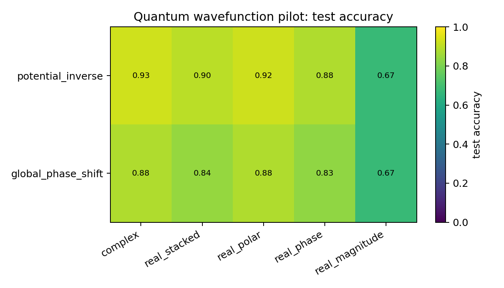
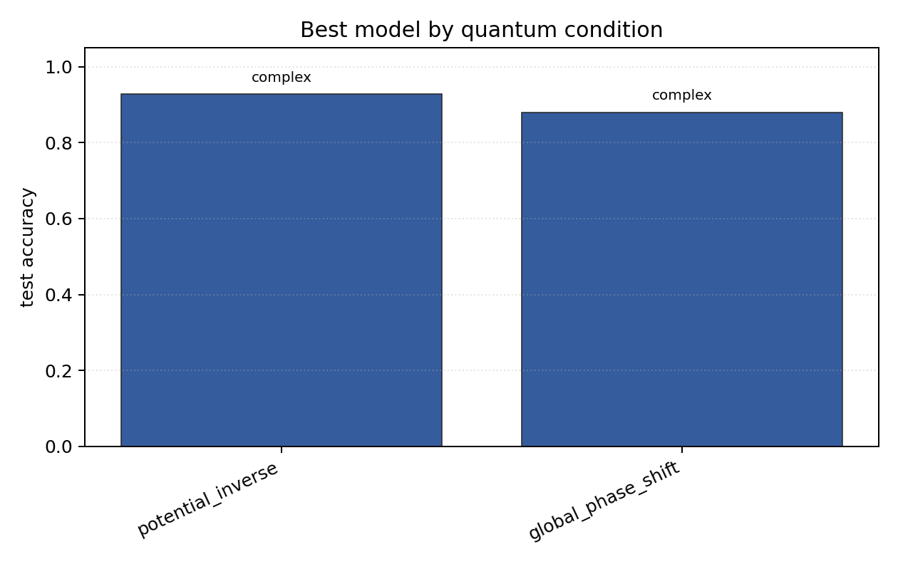

# Quantum Wavefunction Pilot

## Plots

| condition | best | acc | complex | stacked | phase | polar | magnitude |
| --- | --- | ---: | ---: | ---: | ---: | ---: | ---: |
| `potential_inverse` | `complex` | 0.9282 | 0.9282 | 0.8969 | 0.8792 | 0.9224 | 0.6749 |
| `global_phase_shift` | `complex` | 0.8800 | 0.8800 | 0.8431 | 0.8322 | 0.8800 | 0.6745 |

Each condition directory contains `raw_runs.json`, `summary.json`, `summary.md`, `manifest.json`, and plots.
