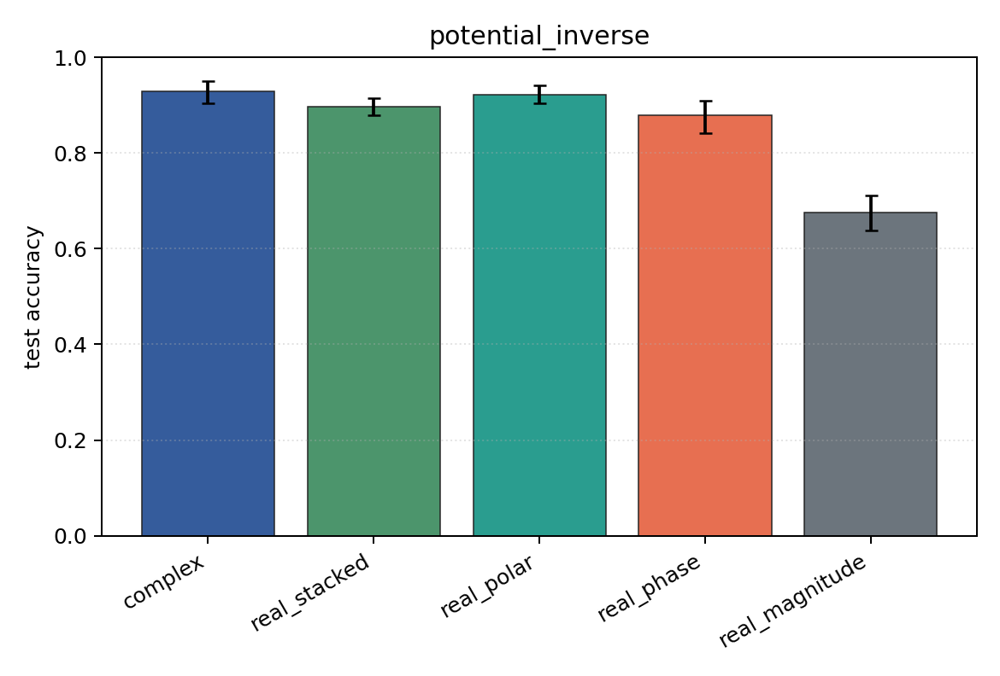
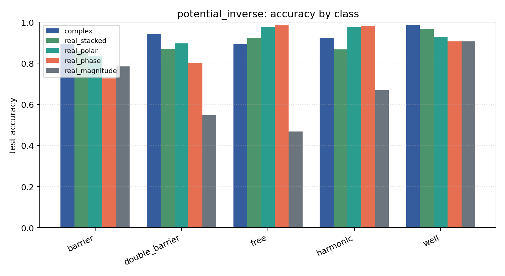

# potential_inverse

Task: `potential_inverse`.

Question: Can models infer which potential generated the observed final wavefunction after 1D Schrodinger evolution?

Expected signal: full complex/Cartesian/polar inputs should outperform phase-only or density-only views when both amplitude and phase carry scattering information.

Preset: `full`. Seeds: `[0, 1, 2, 3, 4]`. Examples/class: `512`. Grid: `128`. Train steps: `400`.

## Plots

| family | acc | 95% CI | loss | params | madds | seconds |
| --- | ---: | ---: | ---: | ---: | ---: | ---: |
| `complex` | 0.9282 | [0.9043, 0.9498] | 0.1967 | 11018 | 2704000 | 2.81 |
| `real_stacked` | 0.8969 | [0.8792, 0.9149] | 0.2989 | 5669 | 696480 | 0.83 |
| `real_polar` | 0.9224 | [0.9035, 0.9420] | 0.2197 | 5829 | 716960 | 0.62 |
| `real_phase` | 0.8792 | [0.8412, 0.9086] | 0.2995 | 5669 | 696480 | 0.93 |
| `real_magnitude` | 0.6749 | [0.6380, 0.7106] | 0.7149 | 5509 | 676000 | 0.94 |
