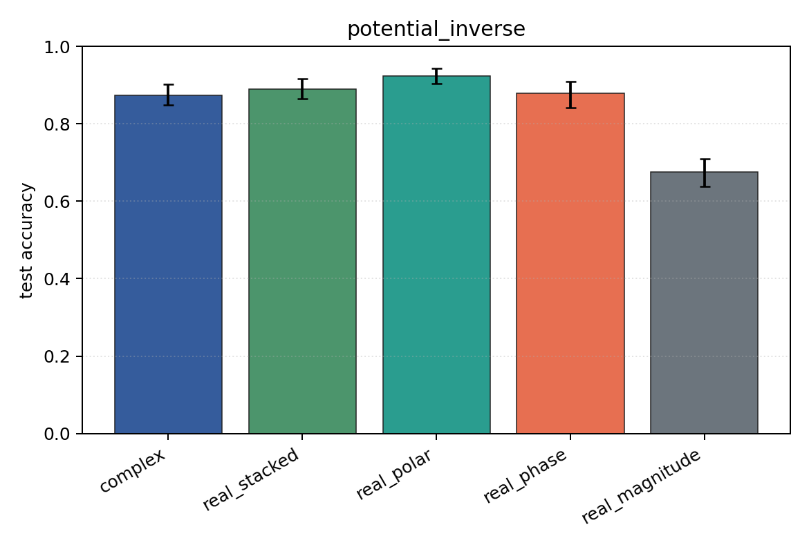
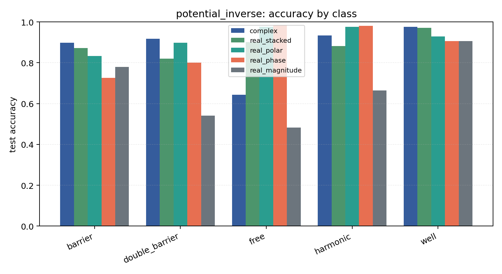

# potential_inverse

Task: `potential_inverse`.

Question: Can models infer which potential generated the observed final wavefunction after 1D Schrodinger evolution?

Expected signal: full complex/Cartesian/polar inputs should outperform phase-only or density-only views when both amplitude and phase carry scattering information.

Preset: `full`. Seeds: `[0, 1, 2, 3, 4]`. Examples/class: `512`. Grid: `128`. Train steps: `400`.

## Plots

| family | acc | 95% CI | loss | params | madds | seconds |
| --- | ---: | ---: | ---: | ---: | ---: | ---: |
| `complex` | 0.8737 | [0.8486, 0.9024] | 0.2884 | 11020 | 2704000 | 5.31 |
| `real_stacked` | 0.8894 | [0.8647, 0.9157] | 0.3081 | 5669 | 696480 | 1.92 |
| `real_polar` | 0.9227 | [0.9035, 0.9427] | 0.2194 | 5829 | 716960 | 1.22 |
| `real_phase` | 0.8792 | [0.8412, 0.9086] | 0.2995 | 5669 | 696480 | 1.01 |
| `real_magnitude` | 0.6749 | [0.6373, 0.7102] | 0.7145 | 5509 | 676000 | 1.14 |
