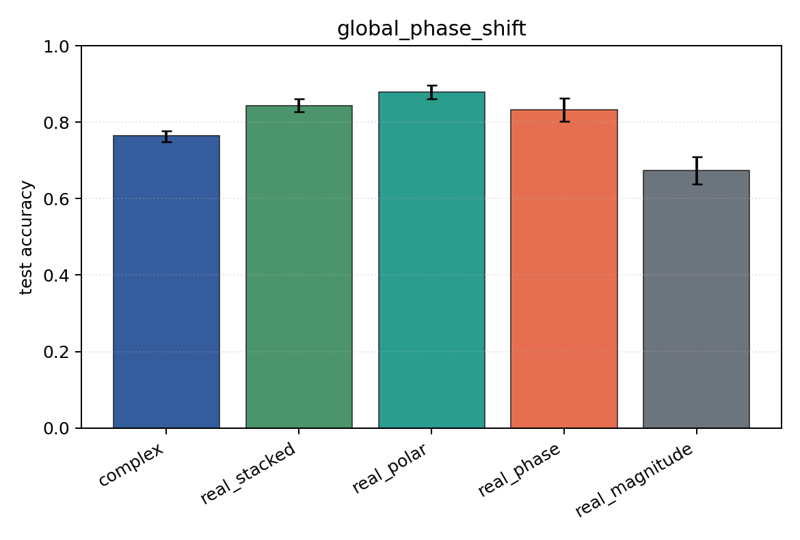
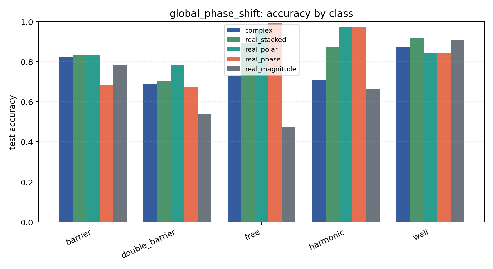

# global_phase_shift

Task: `potential_inverse`.

Question: Do models trained in one global-phase convention respect the physical invariance psi -> exp(i theta) psi?

Expected signal: coordinate-dependent models may degrade under an unseen global phase; magnitude-only is invariant but information-poor.

Preset: `full`. Seeds: `[0, 1, 2, 3, 4]`. Examples/class: `512`. Grid: `128`. Train steps: `400`.

## Plots

| family | acc | 95% CI | loss | params | madds | seconds |
| --- | ---: | ---: | ---: | ---: | ---: | ---: |
| `complex` | 0.7639 | [0.7486, 0.7765] | 0.6233 | 11018 | 2704000 | 4.84 |
| `real_stacked` | 0.8439 | [0.8278, 0.8612] | 0.3918 | 5669 | 696480 | 1.10 |
| `real_polar` | 0.8796 | [0.8616, 0.8969] | 0.3137 | 5829 | 716960 | 0.88 |
| `real_phase` | 0.8325 | [0.8024, 0.8627] | 0.3700 | 5669 | 696480 | 1.31 |
| `real_magnitude` | 0.6741 | [0.6373, 0.7098] | 0.7148 | 5509 | 676000 | 1.24 |
