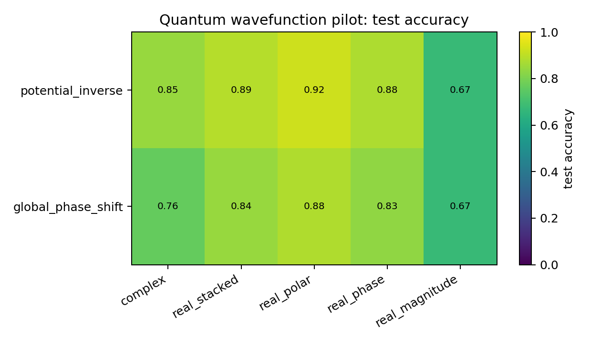
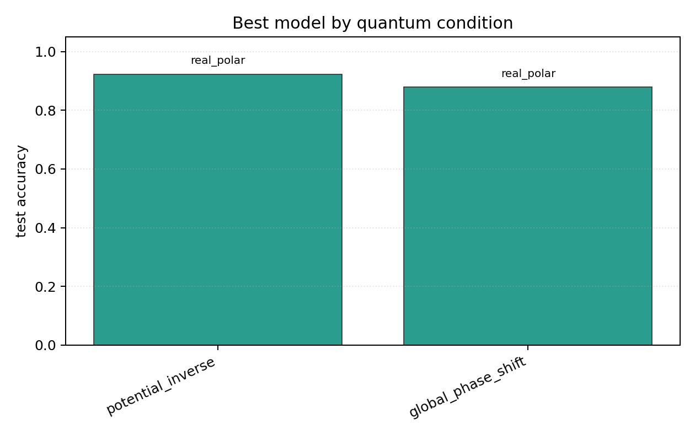

# Quantum Wavefunction Pilot

## Plots

| condition | best | acc | complex | stacked | phase | polar | magnitude |
| --- | --- | ---: | ---: | ---: | ---: | ---: | ---: |
| `potential_inverse` | `real_polar` | 0.9231 | 0.8467 | 0.8882 | 0.8788 | 0.9231 | 0.6745 |
| `global_phase_shift` | `real_polar` | 0.8796 | 0.7639 | 0.8439 | 0.8325 | 0.8796 | 0.6741 |

Each condition directory contains `raw_runs.json`, `summary.json`, `summary.md`, `manifest.json`, and plots.
