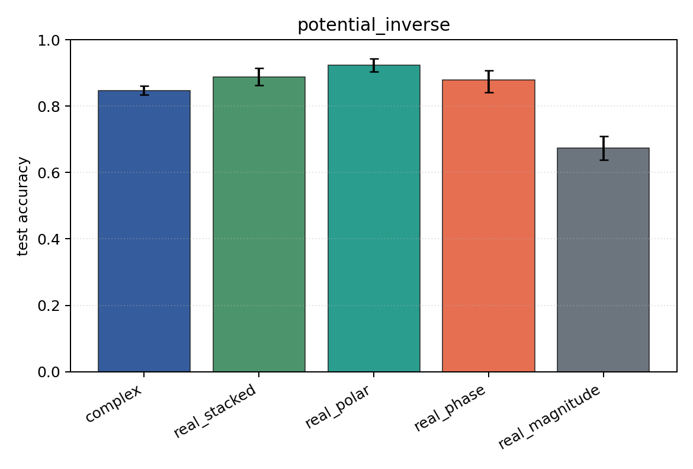
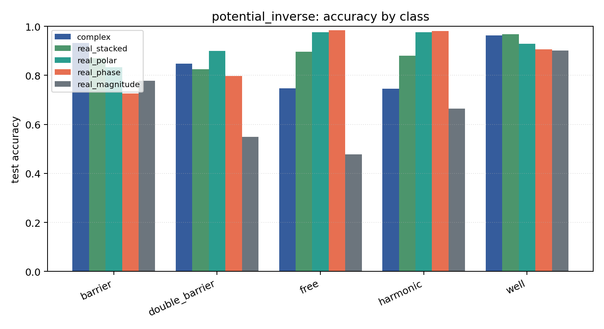

# potential_inverse

Task: `potential_inverse`.

Question: Can models infer which potential generated the observed final wavefunction after 1D Schrodinger evolution?

Expected signal: full complex/Cartesian/polar inputs should outperform phase-only or density-only views when both amplitude and phase carry scattering information.

Preset: `full`. Seeds: `[0, 1, 2, 3, 4]`. Examples/class: `512`. Grid: `128`. Train steps: `400`.

## Plots

| family | acc | 95% CI | loss | params | madds | seconds |
| --- | ---: | ---: | ---: | ---: | ---: | ---: |
| `complex` | 0.8467 | [0.8341, 0.8612] | 0.4499 | 11018 | 2704000 | 3.86 |
| `real_stacked` | 0.8882 | [0.8635, 0.9153] | 0.3092 | 5669 | 696480 | 1.03 |
| `real_polar` | 0.9231 | [0.9039, 0.9431] | 0.2191 | 5829 | 716960 | 0.94 |
| `real_phase` | 0.8788 | [0.8408, 0.9075] | 0.2994 | 5669 | 696480 | 0.94 |
| `real_magnitude` | 0.6745 | [0.6388, 0.7094] | 0.7148 | 5509 | 676000 | 0.67 |
