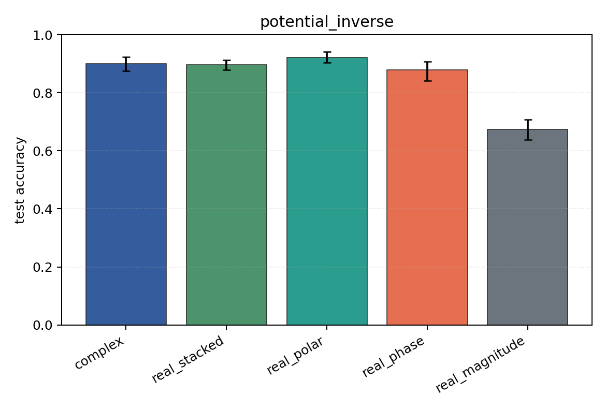
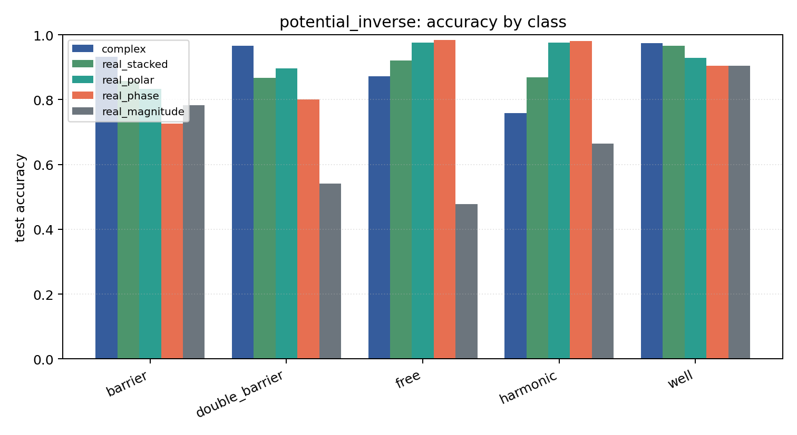

# potential_inverse

Task: `potential_inverse`.

Question: Can models infer which potential generated the observed final wavefunction after 1D Schrodinger evolution?

Expected signal: full complex/Cartesian/polar inputs should outperform phase-only or density-only views when both amplitude and phase carry scattering information.

Preset: `full`. Seeds: `[0, 1, 2, 3, 4]`. Examples/class: `512`. Grid: `128`. Train steps: `400`.

## Plots

| family | acc | 95% CI | loss | params | madds | seconds |
| --- | ---: | ---: | ---: | ---: | ---: | ---: |
| `complex` | 0.9008 | [0.8757, 0.9227] | 0.2576 | 11018 | 2704000 | 2.24 |
| `real_stacked` | 0.8961 | [0.8788, 0.9137] | 0.2991 | 5669 | 696480 | 0.61 |
| `real_polar` | 0.9224 | [0.9035, 0.9420] | 0.2196 | 5829 | 716960 | 1.16 |
| `real_phase` | 0.8788 | [0.8412, 0.9078] | 0.2994 | 5669 | 696480 | 1.62 |
| `real_magnitude` | 0.6741 | [0.6380, 0.7082] | 0.7136 | 5509 | 676000 | 1.48 |
