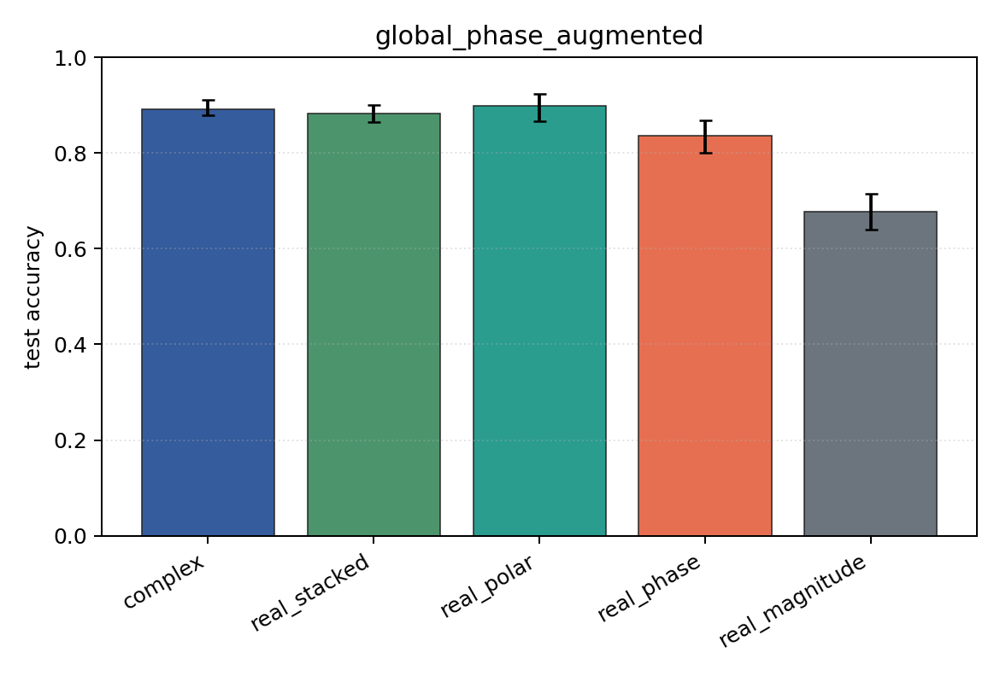
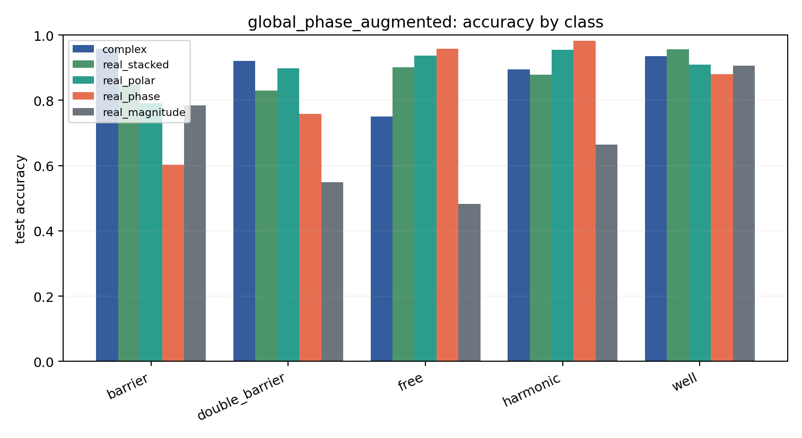

# global_phase_augmented

Task: `potential_inverse`.

Question: Does random global-phase augmentation recover robustness to an unseen fixed global phase?

Expected signal: phase-aware models should improve relative to the unaugmented global-phase stress test.

Preset: `full`. Seeds: `[0, 1, 2, 3, 4]`. Examples/class: `512`. Grid: `128`. Train steps: `400`.

## Plots

| family | acc | 95% CI | loss | params | madds | seconds |
| --- | ---: | ---: | ---: | ---: | ---: | ---: |
| `complex` | 0.8922 | [0.8788, 0.9118] | 0.2693 | 11018 | 2704000 | 2.30 |
| `real_stacked` | 0.8827 | [0.8655, 0.9000] | 0.3210 | 5669 | 696480 | 1.31 |
| `real_polar` | 0.8980 | [0.8670, 0.9243] | 0.2681 | 5829 | 716960 | 0.91 |
| `real_phase` | 0.8365 | [0.8012, 0.8682] | 0.3647 | 5669 | 696480 | 0.61 |
| `real_magnitude` | 0.6773 | [0.6392, 0.7141] | 0.7124 | 5509 | 676000 | 0.55 |
