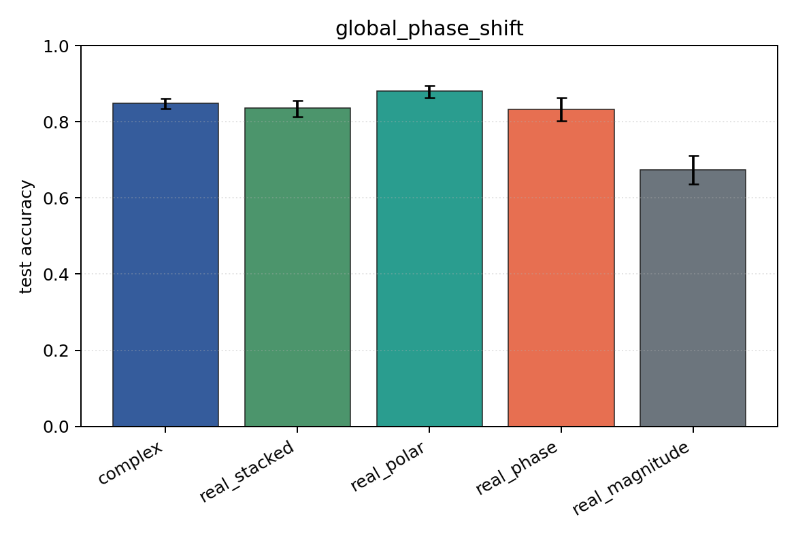
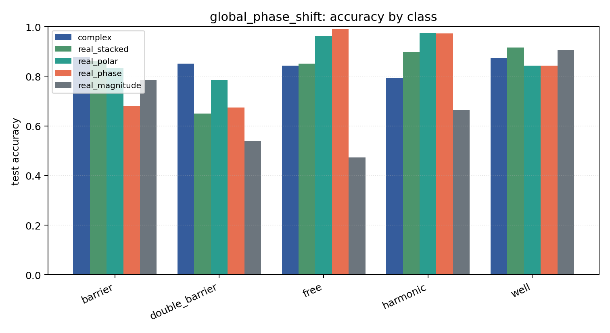

# global_phase_shift

Task: `potential_inverse`.

Question: Do models trained in one global-phase convention respect the physical invariance psi -> exp(i theta) psi?

Expected signal: coordinate-dependent models may degrade under an unseen global phase; magnitude-only is invariant but information-poor.

Preset: `full`. Seeds: `[0, 1, 2, 3, 4]`. Examples/class: `512`. Grid: `128`. Train steps: `400`.

## Plots

| family | acc | 95% CI | loss | params | madds | seconds |
| --- | ---: | ---: | ---: | ---: | ---: | ---: |
| `complex` | 0.8482 | [0.8341, 0.8616] | 0.4186 | 11018 | 2704000 | 2.08 |
| `real_stacked` | 0.8353 | [0.8129, 0.8565] | 0.4029 | 5669 | 696480 | 0.85 |
| `real_polar` | 0.8800 | [0.8627, 0.8957] | 0.3135 | 5829 | 716960 | 1.28 |
| `real_phase` | 0.8322 | [0.8020, 0.8624] | 0.3699 | 5669 | 696480 | 0.92 |
| `real_magnitude` | 0.6733 | [0.6365, 0.7114] | 0.7138 | 5509 | 676000 | 0.74 |
