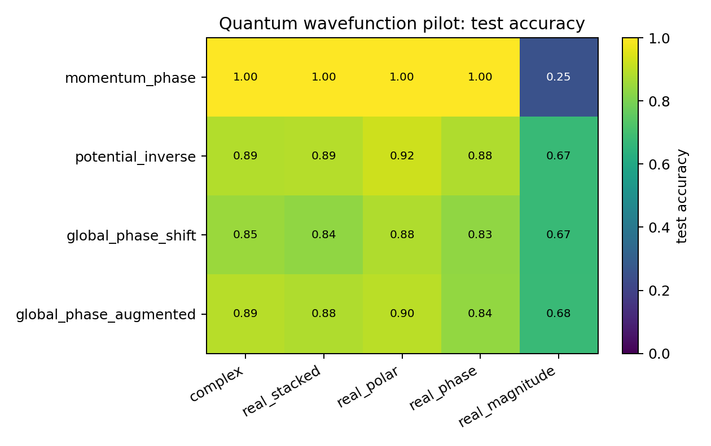
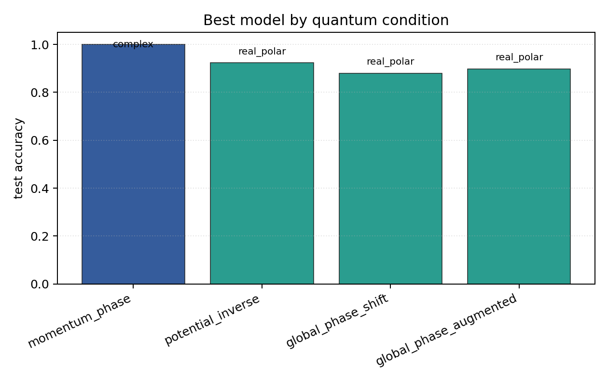

# Quantum Wavefunction Pilot

## Plots

| condition | best | acc | complex | stacked | phase | polar | magnitude |
| --- | --- | ---: | ---: | ---: | ---: | ---: | ---: |
| `momentum_phase` | `complex` | 1.0000 | 1.0000 | 1.0000 | 1.0000 | 1.0000 | 0.2500 |
| `potential_inverse` | `real_polar` | 0.9227 | 0.8863 | 0.8894 | 0.8792 | 0.9227 | 0.6749 |
| `global_phase_shift` | `real_polar` | 0.8800 | 0.8482 | 0.8353 | 0.8322 | 0.8800 | 0.6733 |
| `global_phase_augmented` | `real_polar` | 0.8980 | 0.8922 | 0.8827 | 0.8365 | 0.8980 | 0.6773 |

Each condition directory contains `raw_runs.json`, `summary.json`, `summary.md`, `manifest.json`, and plots.
