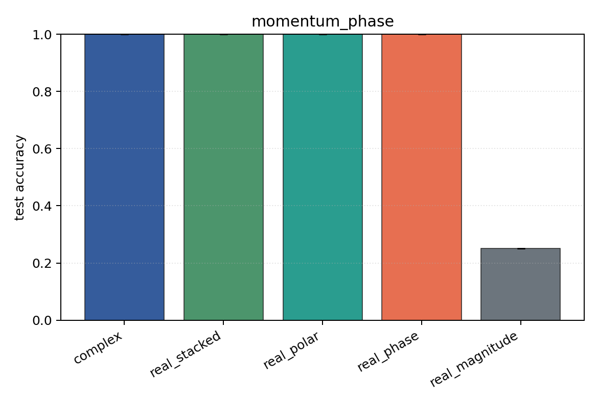
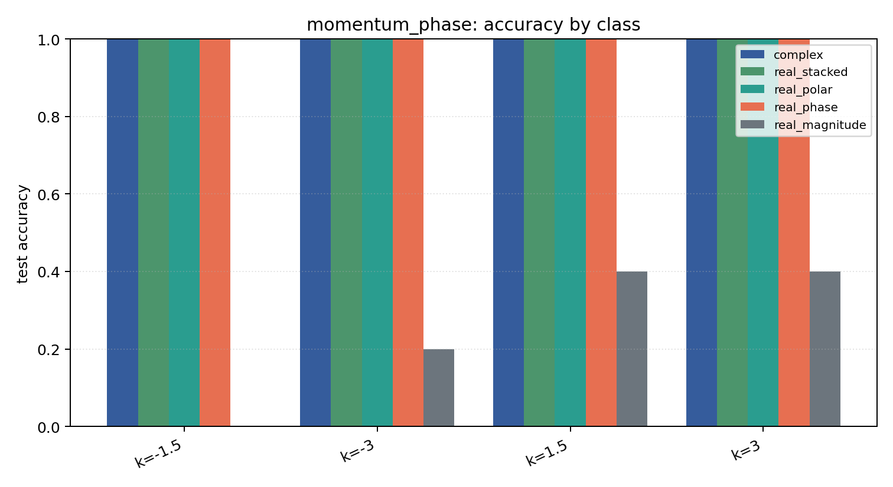

# momentum_phase

Task: `momentum_phase`.

Question: Can models infer wavepacket momentum when the label is stored in the phase gradient rather than in |psi|?

Expected signal: magnitude-only should sit near chance; phase-aware and Cartesian encodings should recover the momentum classes.

Preset: `full`. Seeds: `[0, 1, 2, 3, 4]`. Examples/class: `512`. Grid: `128`. Train steps: `400`.

## Plots

| family | acc | 95% CI | loss | params | madds | seconds |
| --- | ---: | ---: | ---: | ---: | ---: | ---: |
| `complex` | 1.0000 | [1.0000, 1.0000] | 0.0007 | 10952 | 2703872 | 2.12 |
| `real_stacked` | 1.0000 | [1.0000, 1.0000] | 0.0005 | 5636 | 696448 | 1.00 |
| `real_polar` | 1.0000 | [1.0000, 1.0000] | 0.0001 | 5796 | 716928 | 0.97 |
| `real_phase` | 1.0000 | [1.0000, 1.0000] | 0.0001 | 5636 | 696448 | 0.85 |
| `real_magnitude` | 0.2500 | [0.2500, 0.2500] | 1.3864 | 5476 | 675968 | 0.71 |
