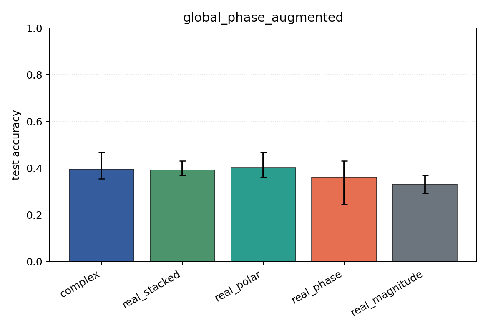
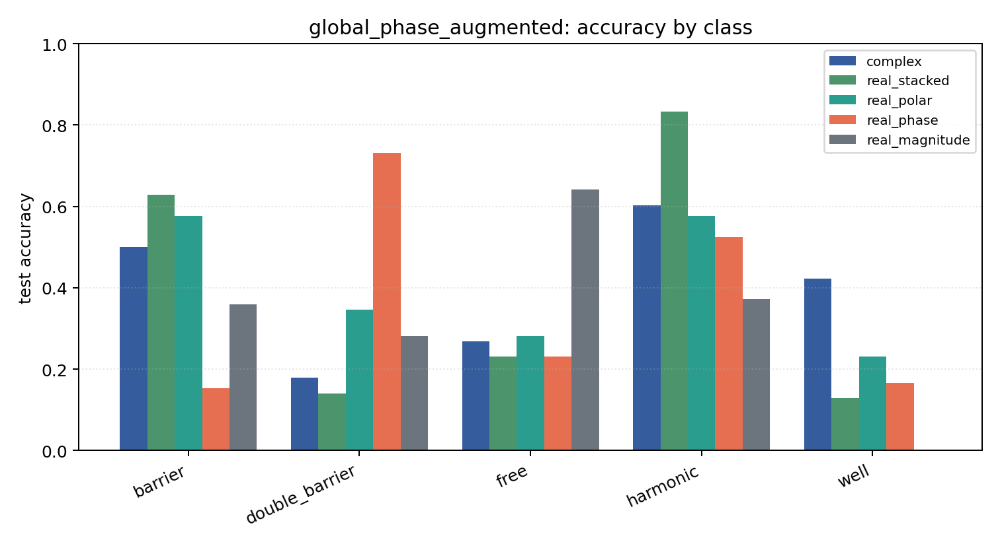

# global_phase_augmented

Task: `potential_inverse`.

Question: Does random global-phase augmentation recover robustness to an unseen fixed global phase?

Expected signal: phase-aware models should improve relative to the unaugmented global-phase stress test.

Preset: `standard`. Seeds: `[0, 1, 2]`. Examples/class: `128`. Grid: `96`. Train steps: `140`.

## Plots

| family | acc | 95% CI | loss | params | madds | seconds |
| --- | ---: | ---: | ---: | ---: | ---: | ---: |
| `complex` | 0.3949 | [0.3538, 0.4692] | 1.3238 | 2954 | 522560 | 5.10 |
| `real_stacked` | 0.3923 | [0.3692, 0.4308] | 1.2298 | 1557 | 138320 | 1.60 |
| `real_polar` | 0.4026 | [0.3615, 0.4692] | 1.3068 | 1637 | 146000 | 1.69 |
| `real_phase` | 0.3615 | [0.2462, 0.4308] | 1.3784 | 1557 | 138320 | 1.76 |
| `real_magnitude` | 0.3308 | [0.2923, 0.3692] | 1.4070 | 1477 | 130640 | 1.60 |
