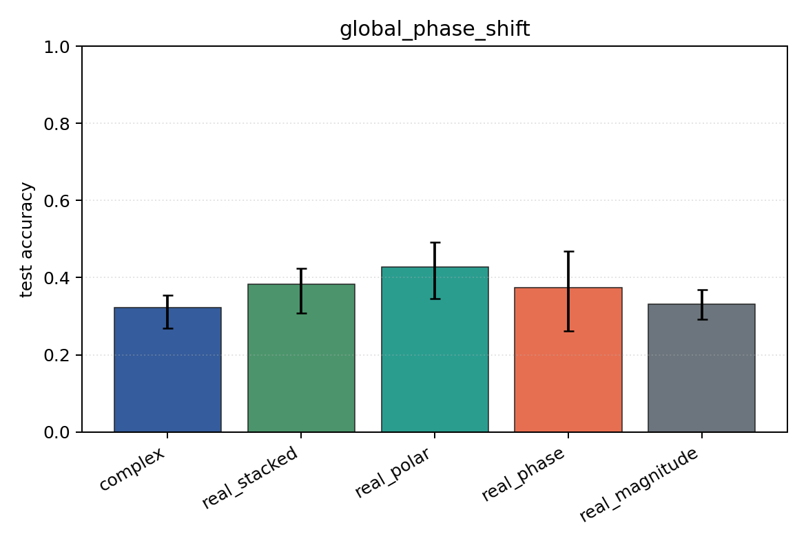
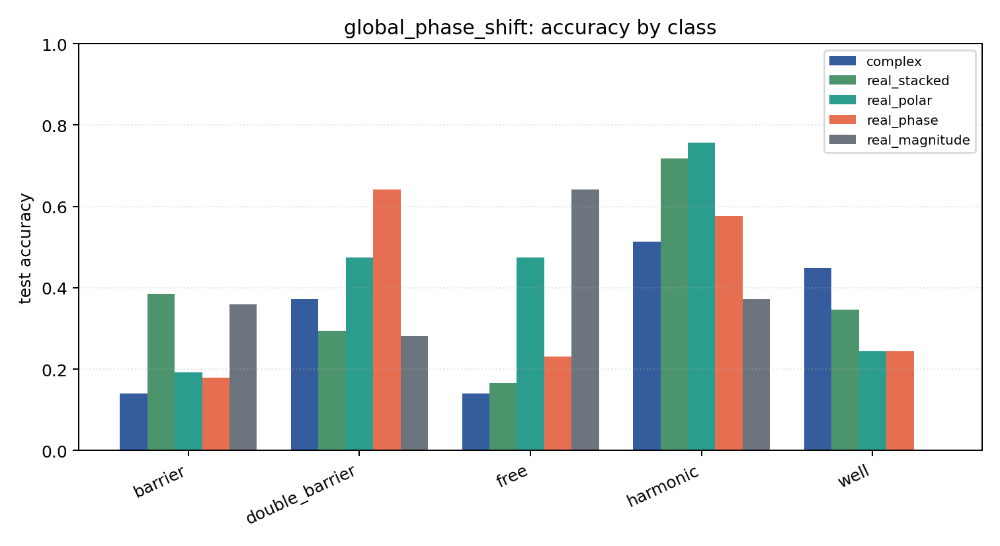

# global_phase_shift

Task: `potential_inverse`.

Question: Do models trained in one global-phase convention respect the physical invariance psi -> exp(i theta) psi?

Expected signal: coordinate-dependent models may degrade under an unseen global phase; magnitude-only is invariant but information-poor.

Preset: `standard`. Seeds: `[0, 1, 2]`. Examples/class: `128`. Grid: `96`. Train steps: `140`.

## Plots

| family | acc | 95% CI | loss | params | madds | seconds |
| --- | ---: | ---: | ---: | ---: | ---: | ---: |
| `complex` | 0.3231 | [0.2692, 0.3538] | 1.4741 | 2954 | 522560 | 5.06 |
| `real_stacked` | 0.3821 | [0.3077, 0.4231] | 1.4029 | 1557 | 138320 | 1.57 |
| `real_polar` | 0.4282 | [0.3462, 0.4923] | 1.3715 | 1637 | 146000 | 1.66 |
| `real_phase` | 0.3744 | [0.2615, 0.4692] | 1.3744 | 1557 | 138320 | 1.57 |
| `real_magnitude` | 0.3308 | [0.2923, 0.3692] | 1.4070 | 1477 | 130640 | 1.56 |
