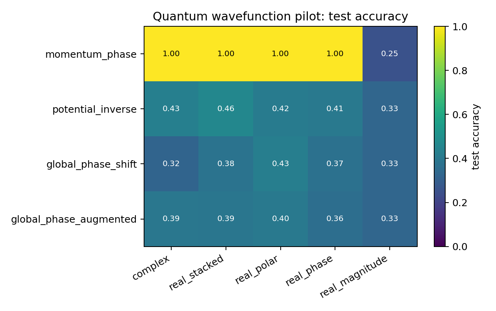
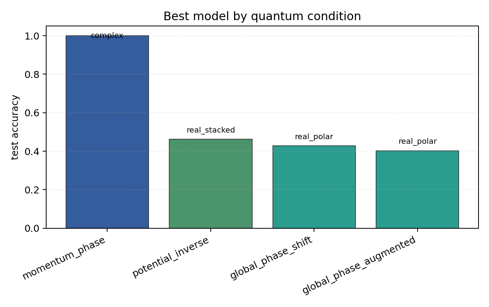

# Quantum Wavefunction Pilot

## Plots

| condition | best | acc | complex | stacked | phase | polar | magnitude |
| --- | --- | ---: | ---: | ---: | ---: | ---: | ---: |
| `momentum_phase` | `complex` | 1.0000 | 1.0000 | 1.0000 | 1.0000 | 1.0000 | 0.2500 |
| `potential_inverse` | `real_stacked` | 0.4615 | 0.4308 | 0.4615 | 0.4051 | 0.4179 | 0.3308 |
| `global_phase_shift` | `real_polar` | 0.4282 | 0.3231 | 0.3821 | 0.3744 | 0.4282 | 0.3308 |
| `global_phase_augmented` | `real_polar` | 0.4026 | 0.3949 | 0.3923 | 0.3615 | 0.4026 | 0.3308 |

Each condition directory contains `raw_runs.json`, `summary.json`, `summary.md`, `manifest.json`, and plots.
