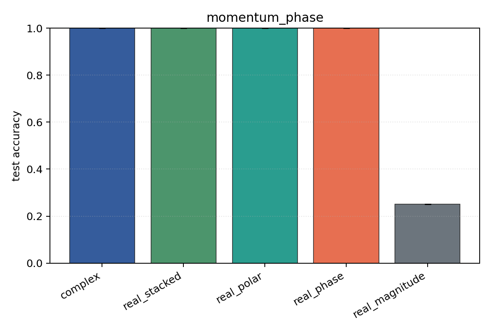
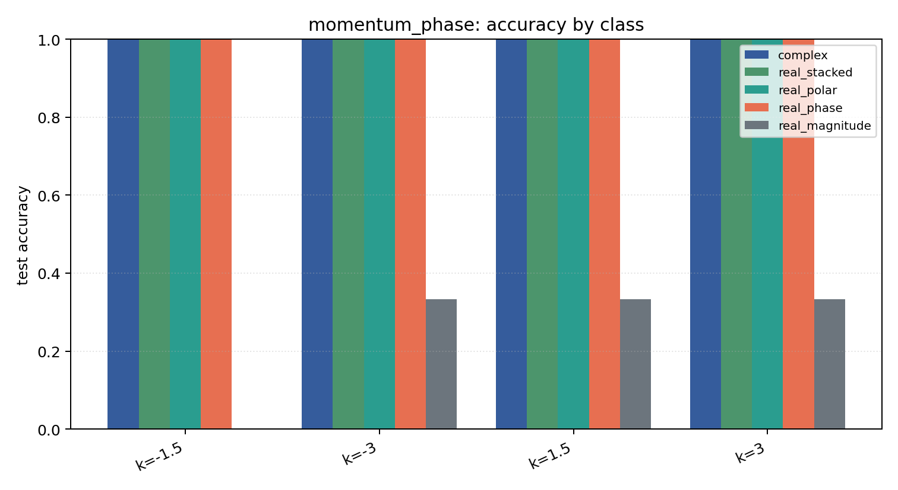

# momentum_phase

Task: `momentum_phase`.

Question: Can models infer wavepacket momentum when the label is stored in the phase gradient rather than in |psi|?

Expected signal: magnitude-only should sit near chance; phase-aware and Cartesian encodings should recover the momentum classes.

Preset: `standard`. Seeds: `[0, 1, 2]`. Examples/class: `128`. Grid: `96`. Train steps: `140`.

## Plots

| family | acc | 95% CI | loss | params | madds | seconds |
| --- | ---: | ---: | ---: | ---: | ---: | ---: |
| `complex` | 1.0000 | [1.0000, 1.0000] | 0.0214 | 2920 | 522496 | 5.09 |
| `real_stacked` | 1.0000 | [1.0000, 1.0000] | 0.0159 | 1540 | 138304 | 1.55 |
| `real_polar` | 1.0000 | [1.0000, 1.0000] | 0.0011 | 1620 | 145984 | 1.67 |
| `real_phase` | 1.0000 | [1.0000, 1.0000] | 0.0012 | 1540 | 138304 | 1.63 |
| `real_magnitude` | 0.2500 | [0.2500, 0.2500] | 1.3868 | 1460 | 130624 | 1.57 |
