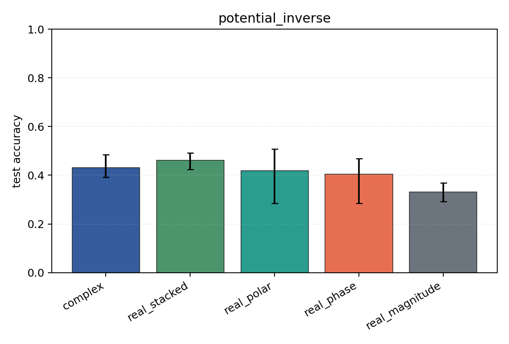
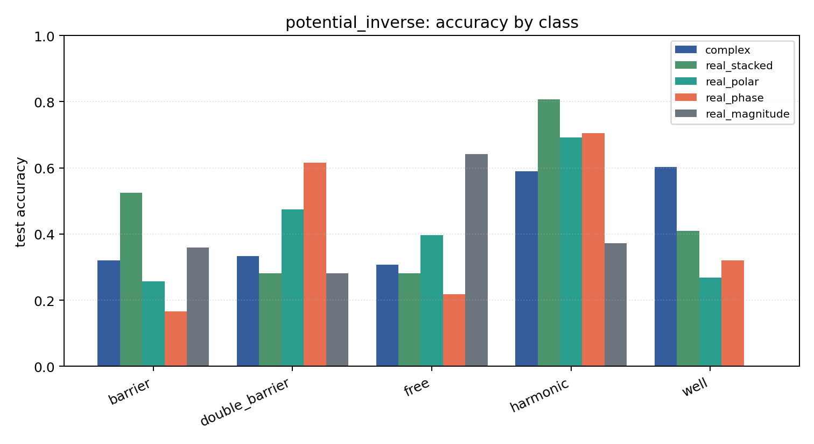

# potential_inverse

Task: `potential_inverse`.

Question: Can models infer which potential generated the observed final wavefunction after 1D Schrodinger evolution?

Expected signal: full complex/Cartesian/polar inputs should outperform phase-only or density-only views when both amplitude and phase carry scattering information.

Preset: `standard`. Seeds: `[0, 1, 2]`. Examples/class: `128`. Grid: `96`. Train steps: `140`.

## Plots

| family | acc | 95% CI | loss | params | madds | seconds |
| --- | ---: | ---: | ---: | ---: | ---: | ---: |
| `complex` | 0.4308 | [0.3923, 0.4846] | 1.2586 | 2954 | 522560 | 5.10 |
| `real_stacked` | 0.4615 | [0.4231, 0.4923] | 1.1846 | 1557 | 138320 | 1.56 |
| `real_polar` | 0.4179 | [0.2846, 0.5077] | 1.3763 | 1637 | 146000 | 1.69 |
| `real_phase` | 0.4051 | [0.2846, 0.4692] | 1.3717 | 1557 | 138320 | 1.65 |
| `real_magnitude` | 0.3308 | [0.2923, 0.3692] | 1.4070 | 1477 | 130640 | 1.59 |
