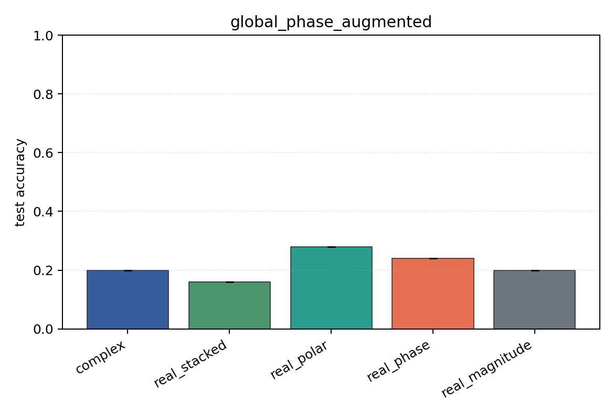
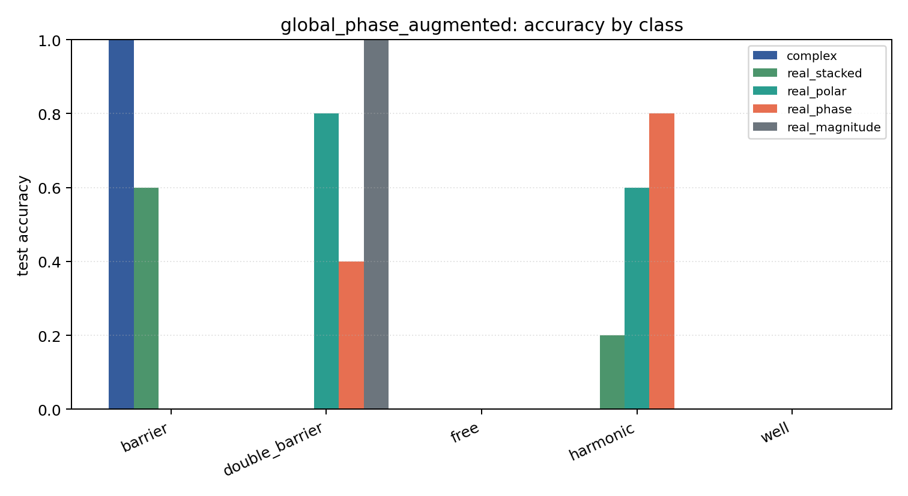

# global_phase_augmented

Task: `potential_inverse`.

Question: Does random global-phase augmentation recover robustness to an unseen fixed global phase?

Expected signal: phase-aware models should improve relative to the unaugmented global-phase stress test.

Preset: `smoke`. Seeds: `[0]`. Examples/class: `24`. Grid: `48`. Train steps: `30`.

## Plots

| family | acc | 95% CI | loss | params | madds | seconds |
| --- | ---: | ---: | ---: | ---: | ---: | ---: |
| `complex` | 0.2000 | [0.2000, 0.2000] | 1.6111 | 842 | 69280 | 0.22 |
| `real_stacked` | 0.1600 | [0.1600, 0.1600] | 1.6136 | 461 | 19240 | 0.08 |
| `real_polar` | 0.2800 | [0.2800, 0.2800] | 1.6206 | 501 | 21160 | 0.08 |
| `real_phase` | 0.2400 | [0.2400, 0.2400] | 1.6141 | 461 | 19240 | 0.09 |
| `real_magnitude` | 0.2000 | [0.2000, 0.2000] | 1.6107 | 421 | 17320 | 0.08 |
