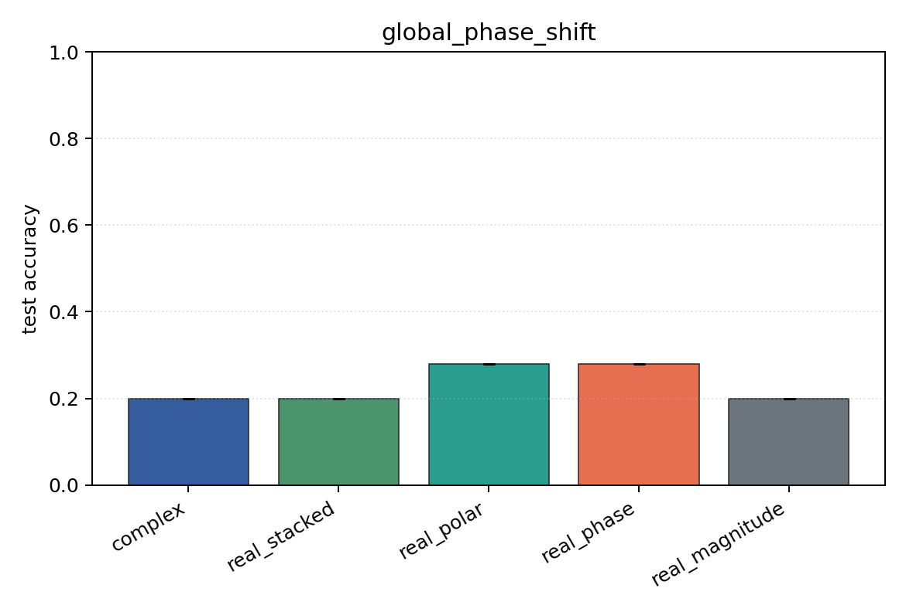
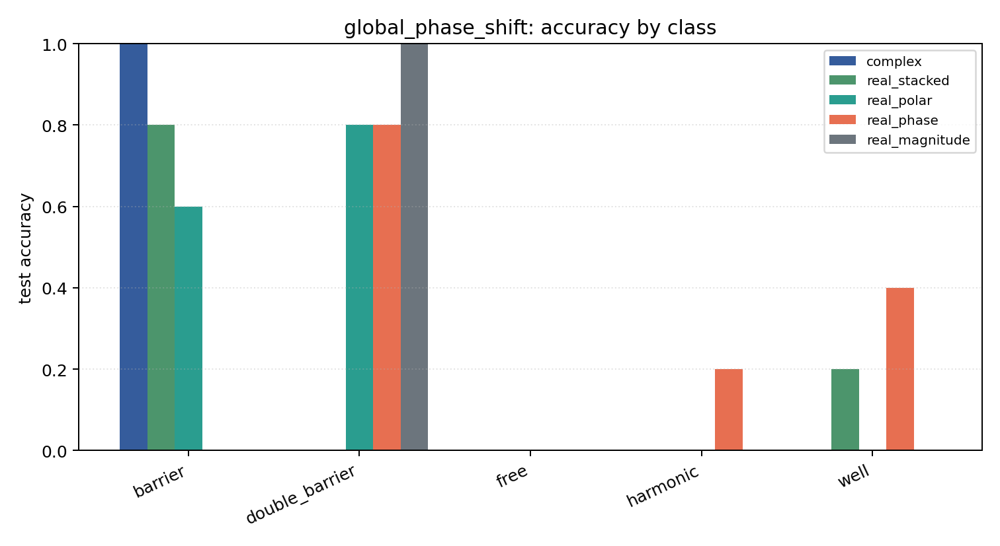

# global_phase_shift

Task: `potential_inverse`.

Question: Do models trained in one global-phase convention respect the physical invariance psi -> exp(i theta) psi?

Expected signal: coordinate-dependent models may degrade under an unseen global phase; magnitude-only is invariant but information-poor.

Preset: `smoke`. Seeds: `[0]`. Examples/class: `24`. Grid: `48`. Train steps: `30`.

## Plots

| family | acc | 95% CI | loss | params | madds | seconds |
| --- | ---: | ---: | ---: | ---: | ---: | ---: |
| `complex` | 0.2000 | [0.2000, 0.2000] | 1.6077 | 842 | 69280 | 0.23 |
| `real_stacked` | 0.2000 | [0.2000, 0.2000] | 1.6075 | 461 | 19240 | 0.08 |
| `real_polar` | 0.2800 | [0.2800, 0.2800] | 1.6044 | 501 | 21160 | 0.08 |
| `real_phase` | 0.2800 | [0.2800, 0.2800] | 1.6064 | 461 | 19240 | 0.08 |
| `real_magnitude` | 0.2000 | [0.2000, 0.2000] | 1.6107 | 421 | 17320 | 0.08 |
