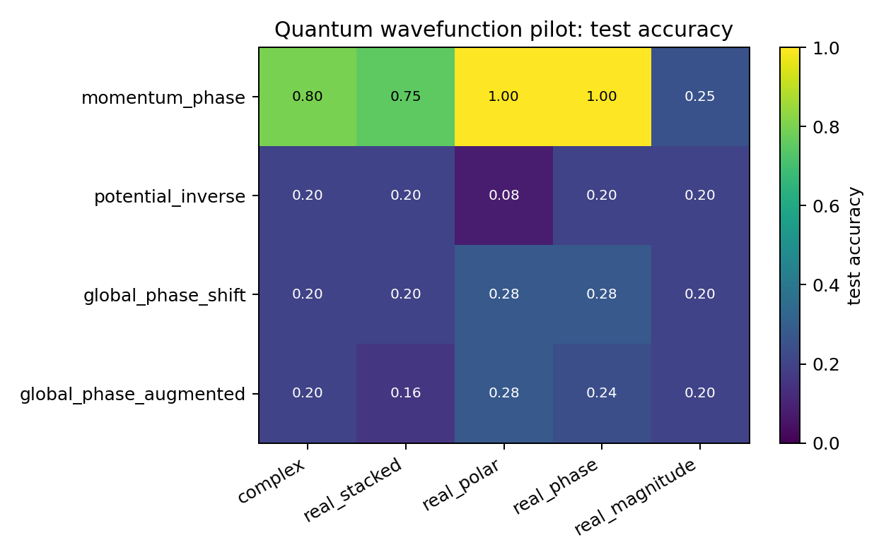
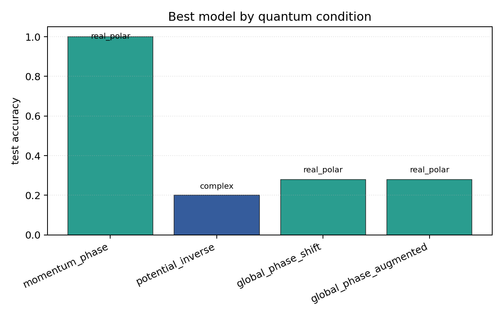

# Quantum Wavefunction Pilot

## Plots

| condition | best | acc | complex | stacked | phase | polar | magnitude |
| --- | --- | ---: | ---: | ---: | ---: | ---: | ---: |
| `momentum_phase` | `real_polar` | 1.0000 | 0.8000 | 0.7500 | 1.0000 | 1.0000 | 0.2500 |
| `potential_inverse` | `complex` | 0.2000 | 0.2000 | 0.2000 | 0.2000 | 0.0800 | 0.2000 |
| `global_phase_shift` | `real_polar` | 0.2800 | 0.2000 | 0.2000 | 0.2800 | 0.2800 | 0.2000 |
| `global_phase_augmented` | `real_polar` | 0.2800 | 0.2000 | 0.1600 | 0.2400 | 0.2800 | 0.2000 |

Each condition directory contains `raw_runs.json`, `summary.json`, `summary.md`, `manifest.json`, and plots.
