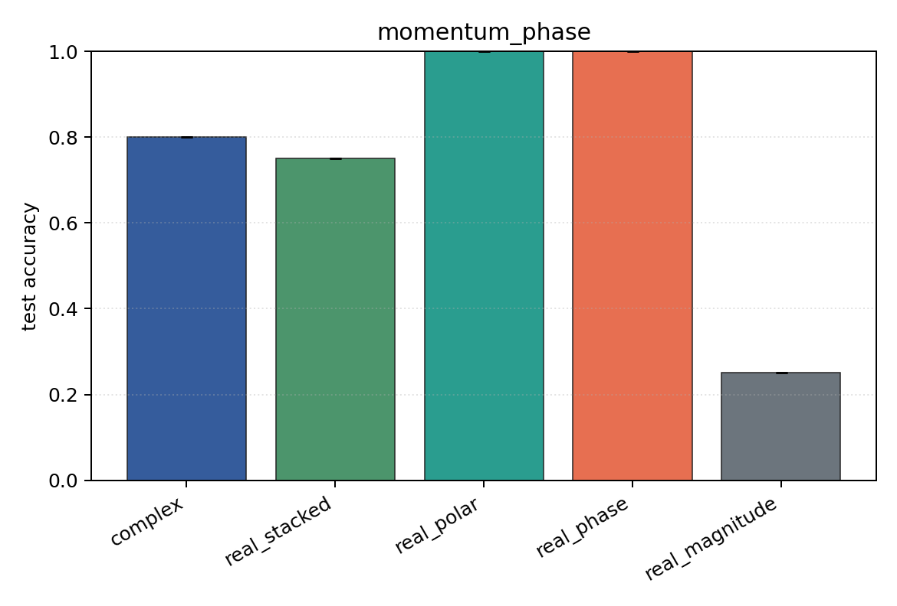
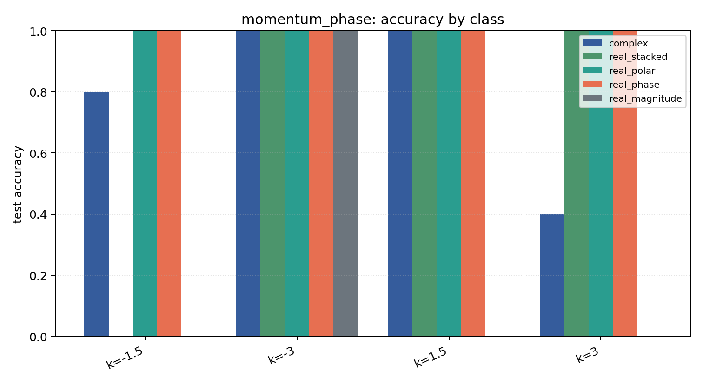

# momentum_phase

Task: `momentum_phase`.

Question: Can models infer wavepacket momentum when the label is stored in the phase gradient rather than in |psi|?

Expected signal: magnitude-only should sit near chance; phase-aware and Cartesian encodings should recover the momentum classes.

Preset: `smoke`. Seeds: `[0]`. Examples/class: `24`. Grid: `48`. Train steps: `30`.

## Plots

| family | acc | 95% CI | loss | params | madds | seconds |
| --- | ---: | ---: | ---: | ---: | ---: | ---: |
| `complex` | 0.8000 | [0.8000, 0.8000] | 1.2857 | 824 | 69248 | 0.25 |
| `real_stacked` | 0.7500 | [0.7500, 0.7500] | 1.2329 | 452 | 19232 | 0.08 |
| `real_polar` | 1.0000 | [1.0000, 1.0000] | 0.4802 | 492 | 21152 | 0.22 |
| `real_phase` | 1.0000 | [1.0000, 1.0000] | 0.4620 | 452 | 19232 | 0.11 |
| `real_magnitude` | 0.2500 | [0.2500, 0.2500] | 1.3887 | 412 | 17312 | 0.09 |
