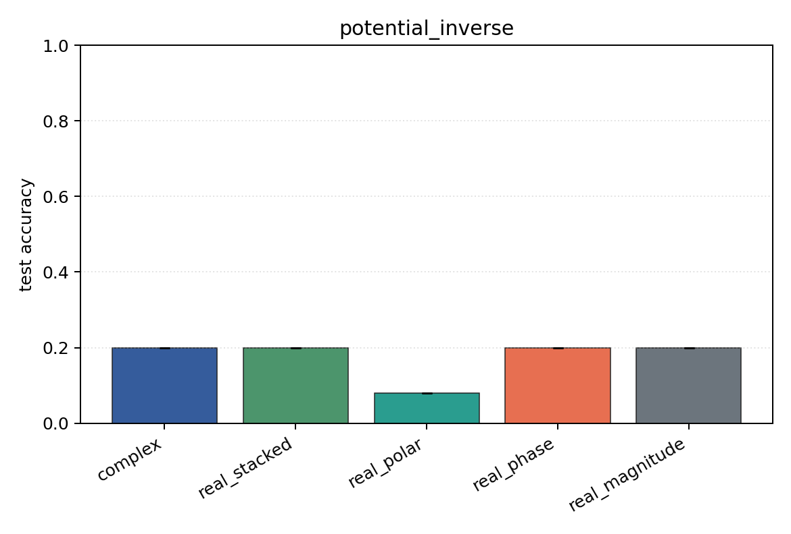
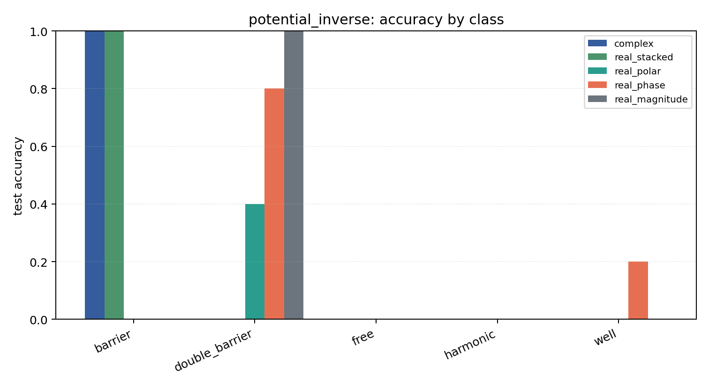

# potential_inverse

Task: `potential_inverse`.

Question: Can models infer which potential generated the observed final wavefunction after 1D Schrodinger evolution?

Expected signal: full complex/Cartesian/polar inputs should outperform phase-only or density-only views when both amplitude and phase carry scattering information.

Preset: `smoke`. Seeds: `[0]`. Examples/class: `24`. Grid: `48`. Train steps: `30`.

## Plots

| family | acc | 95% CI | loss | params | madds | seconds |
| --- | ---: | ---: | ---: | ---: | ---: | ---: |
| `complex` | 0.2000 | [0.2000, 0.2000] | 1.6099 | 842 | 69280 | 0.34 |
| `real_stacked` | 0.2000 | [0.2000, 0.2000] | 1.6092 | 461 | 19240 | 0.08 |
| `real_polar` | 0.0800 | [0.0800, 0.0800] | 1.6219 | 501 | 21160 | 0.08 |
| `real_phase` | 0.2000 | [0.2000, 0.2000] | 1.6576 | 461 | 19240 | 0.08 |
| `real_magnitude` | 0.2000 | [0.2000, 0.2000] | 1.6107 | 421 | 17320 | 0.08 |
