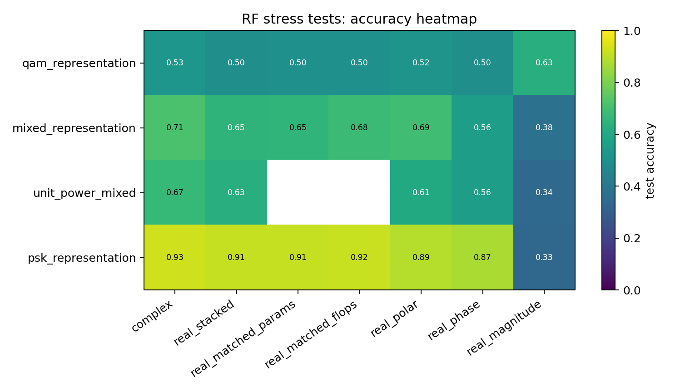
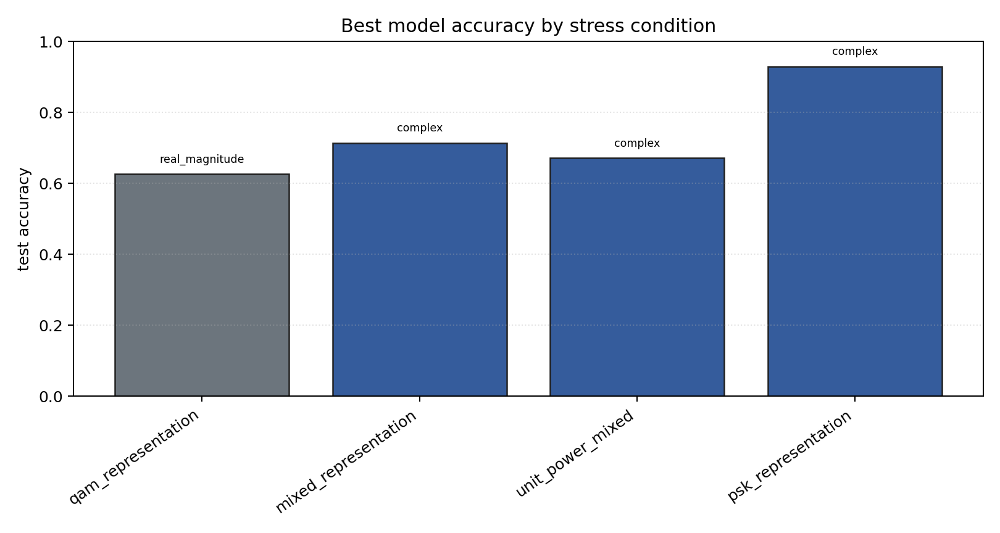

# RF Synthetic Representation Stress Tests

Sequential contradiction tests for whether complex-valued RF models help because of native complex arithmetic, coordinate choice, phase information, augmentation, or compute budget.

## Plots

| condition | best | acc | complex | real_stack | phase | polar | magnitude |
| --- | --- | ---: | ---: | ---: | ---: | ---: | ---: |
| `qam_representation` | `real_magnitude` | 0.6265 | 0.5265 | 0.4994 | 0.4990 | 0.5178 | 0.6265 |
| `mixed_representation` | `complex` | 0.7140 | 0.7140 | 0.6485 | 0.5603 | 0.6937 | 0.3762 |
| `unit_power_mixed` | `complex` | 0.6713 | 0.6713 | 0.6321 | 0.5609 | 0.6072 | 0.3420 |
| `psk_representation` | `complex` | 0.9294 | 0.9294 | 0.9105 | 0.8749 | 0.8902 | 0.3348 |

Each condition directory contains `raw_runs.json`, `summary.json`, `summary.md`, and `manifest.json`.
