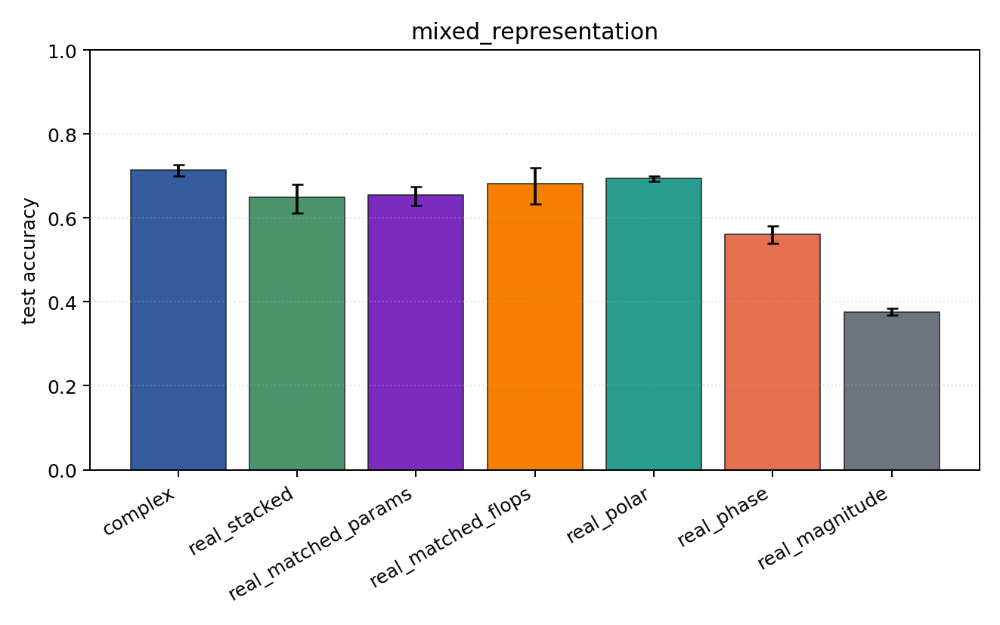
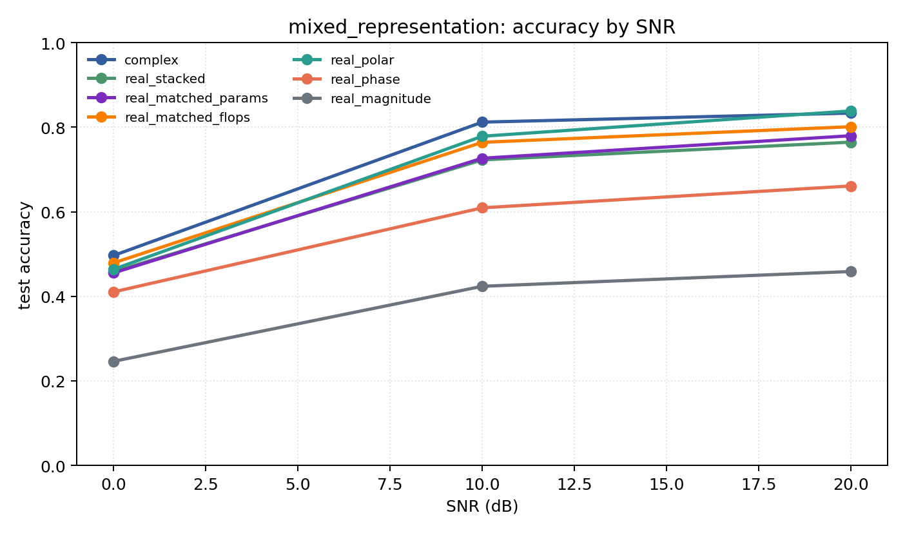

# mixed_representation

Question: Does the representation conclusion survive PSK+QAM together?

Contradiction signal: a hand-chosen real coordinate system matches or beats the complex model over mixed modulation families.

Modulations: `['bpsk', 'qpsk', '8psk', 'qam16', 'qam64']`. SNR (dB): `[0, 10, 20]`. Architecture: `conv`. Activation: `cardioid`. Train transform: `none`. Test transform: `none`.

## Plots

| model | hidden | params | MAdds | accuracy | std | 95% CI | loss | s/run |
| --- | ---: | ---: | ---: | ---: | ---: | --- | ---: | ---: |
| `complex` | 32 | 11018 | 2704000 | 0.7140 | 0.0180 | [0.6989, 0.7272] | 0.642 | 4.4 |
| `real_stacked` | 32 | 5669 | 696480 | 0.6485 | 0.0430 | [0.6120, 0.6797] | 0.791 | 1.2 |
| `real_matched_params` | 45 | 10895 | 1353825 | 0.6540 | 0.0287 | [0.6294, 0.6740] | 0.803 | 2.3 |
| `real_matched_flops` | 64 | 21573 | 2703680 | 0.6816 | 0.0573 | [0.6331, 0.7199] | 0.687 | 2.4 |
| `real_polar` | 32 | 5829 | 716960 | 0.6937 | 0.0084 | [0.6872, 0.6998] | 0.647 | 2.2 |
| `real_phase` | 32 | 5669 | 696480 | 0.5603 | 0.0268 | [0.5398, 0.5807] | 0.943 | 2.2 |
| `real_magnitude` | 32 | 5509 | 676000 | 0.3762 | 0.0104 | [0.3675, 0.3845] | 1.18 | 2.1 |

## Accuracy by SNR (dB)

| model | 0 dB | 10 dB | 20 dB |
| --- | ---: | ---: | ---: |
| `complex` | 0.497 | 0.812 | 0.833 |
| `real_stacked` | 0.458 | 0.723 | 0.765 |
| `real_matched_params` | 0.456 | 0.727 | 0.780 |
| `real_matched_flops` | 0.479 | 0.764 | 0.801 |
| `real_polar` | 0.464 | 0.779 | 0.838 |
| `real_phase` | 0.410 | 0.609 | 0.661 |
| `real_magnitude` | 0.246 | 0.424 | 0.459 |
